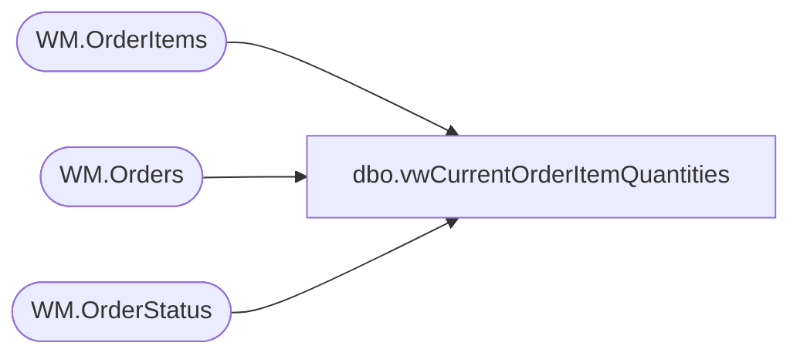

# dbo.vwCurrentOrderItemQuantities

**Database:** WebOrderProcessing  
**Server:** bearcluster01  

## Architecture Diagram



## Table Dependencies

| Referenced Table |
|---|
| WM.OrderItems |
| WM.Orders |
| WM.OrderStatus |

## View Code

```sql
CREATE VIEW [dbo].[vwCurrentOrderItemQuantities]
AS

SELECT O1.PickupStore AS OutletID, oi.sku AS Style, SUM(oi.qty) AS OrderQty
FROM WM.Orders AS O1
INNER JOIN WM.OrderStatus AS s ON O1.OrderId = s.OrderId AND s.CurrentStatus = 1 
INNER JOIN WM.OrderItems AS oi ON O1.OrderId = oi.OrderId AND LEN(oi.sku) = 6
WHERE (ISNULL(O1.PickTicketFlag, 0) = 0)
AND (O1.SourceSite = 'BABW-US')
AND (O1.OrderStatus = 'Pending') AND (CHARINDEX('_', O1.OrderNum, 1) > 0)
AND (O1.PickupStore <> 13)
GROUP BY O1.PickupStore, oi.sku
```

