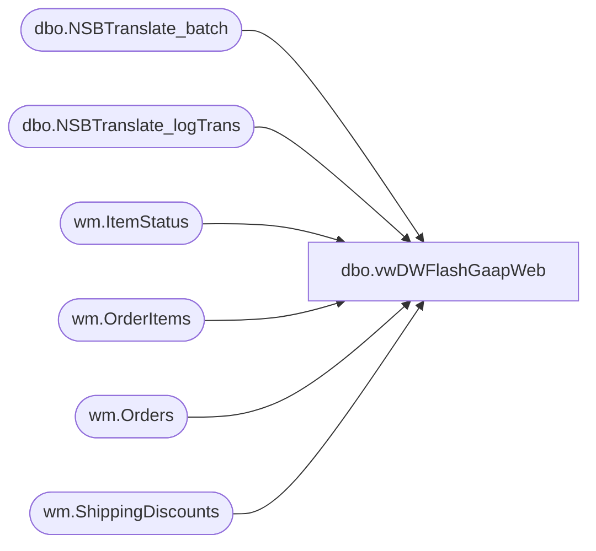

# dbo.vwDWFlashGaapWeb

**Database:** WebOrderProcessing  
**Server:** bearcluster01  

## Architecture Diagram



## Table Dependencies

| Referenced Table |
|---|
| dbo.NSBTranslate_batch |
| dbo.NSBTranslate_logTrans |
| wm.ItemStatus |
| wm.OrderItems |
| wm.Orders |
| wm.ShippingDiscounts |

## View Code

```sql
CREATE view [dbo].[vwDWFlashGaapWeb]

as


with
ShippedOrders as
	(
			select 
				t.sOrderNumber SettledOrderNumber, max(t.dTimeStamp) SettlementDate, left(t.sOrderNumber,8) SettledOrder
			from BABWeCommerce.dbo.NSBTranslate_logTrans t with (nolock)
				join BABWeCommerce.dbo.NSBTranslate_batch b with (nolock) on t.sBatchID=b.sBatchID 
			where b.bSentToAW = 1 
			and t.sOrderNumber like '%[_]%'
				--and t.sStore not in (13,2013)
				and datediff(dd, t.dTimeStamp, getdate())<= 200
			group by 
				t.sOrderNumber,
				left(t.sOrderNumber,8)
	),
OrderShipping as
	(
		select 
			o.OrderID,
			sum(o.ShippingAmount) OrderShipping
		from wm.Orders o with (nolock)
		where o.OrderNum in (select SettledOrderNumber from ShippedOrders)
		group by o.OrderId
	),
ShippingDiscounts as
	(
		select 
			OrderID,
			sum(DiscountAmount) ShippingDiscount
		from wm.ShippingDiscounts
		where OrderID in (select OrderID from OrderShipping)
		group by OrderID
	),
Shipping as
	(
		select
			os.OrderID,
			case 
				when (os.OrderShipping-isnull(sd.ShippingDiscount,0)) < 0
					then 0
				else (os.OrderShipping-isnull(sd.ShippingDiscount,0))
			end as Shipping
		from OrderShipping os
		left join ShippingDiscounts sd on os.OrderID=sd.OrderID
	),
SalesTransactionSite as
	(
		select distinct 
			o.OrderID as TransactionID,

			case
				when isnull(o.PickupStore,'') in ('0013', '2013') or isnull(o.PickupStore,'') = ''
				then 
					case
						when right(o.SourceSite,2) = 'US' then '0013'
						when right(o.SourceSite,2) = 'UK' then '2013'
					end
				else o.PickupStore
			end as LocationCode,
			case
				when isnull(o.PickupStore,'') in ('0013', '2013') or isnull(o.PickupStore,'') = ''
				then 
					case
						when right(o.SourceSite,2) = 'US' then 'US Web'
						when right(o.SourceSite,2) = 'UK' then 'UK Web'
					end
				else o.PickupStore
			end as LocationName,			
			case
				when isnull(o.PickupStore,'') in ('0013', '2013') or isnull(o.PickupStore,'') = ''
				then 
					case
						when right(o.SourceSite,2) = 'US' then 13
						when right(o.SourceSite,2) = 'UK' then 2013
					end
				else o.PickupStore
			end as StoreNumber,
			o.OrderNum as TransactionNum,
			case
				when isnull(o.PickupStore,'') in ('0013', '2013') or isnull(o.PickupStore,'') = ''
					then 0
				else 1
			end as isBOSISorBOPIS,
			sum(oi.DiscountedPrice) + s.Shipping as TotalCharges,
			so.SettlementDate ShipDate,
			so.SettledOrderNumber,
			so.SettledOrder,
			oi.SKU SettledSKU
			--case 
			--	when exists 
			--		(
			--			select td.TransactionID 
			--			from wm.OMSTransactionDetails td with (nolock)
			--			where td.PaymentTransactionType='return' 
			--			and o.TransactionID=td.TransactionID 
			--			and right(o.OrderNum,1)=td.ShipmentNumber
			--			group by td.TransactionID
			--		)
			--	then 1 
			--	else 0
			--end as isReturn
			--case
			--	when exists
			--		(
			--			select 
			--				r.OrderNumber, 
			--				r.DeckSku 
			--			from
			--				Returnz r
			--			where r.OrderNumber=left(so.SettledOrderNumber,8)
			--			and r.DeckSKU=oi.sku
			--			group by 
			--				r.OrderNumber, 
			--				r.DeckSku
			--		)
			--	then 1
			--	else 0
			--end as isReturn
		from ShippedOrders so
		--wm.Transactions t with (nolock)
		join wm.Orders o with (nolock) on so.SettledOrderNumber=o.OrderNum 
		join wm.OrderItems oi with (nolock) 
			on o.orderID=oi.OrderID
			and oi.GiftCardNumber is NULL
			and len(oi.sku) = 6
			and oi.OrderItemID not in (select OrderItemId from wm.ItemStatus with (nolock) where status = 'IV') --cancelled item??
		left join Shipping s on o.OrderID=s.OrderID
		group by 
			--t.TransactionID,
			o.OrderID,
			case
				when isnull(o.PickupStore,'') in ('0013', '2013') or isnull(o.PickupStore,'') = ''
				then 
					case
						when right(o.SourceSite,2) = 'US' then '0013'
						when right(o.SourceSite,2) = 'UK' then '2013'
					end
				else o.PickupStore
			end,
			case
				when isnull(o.PickupStore,'') in ('0013', '2013') or isnull(o.PickupStore,'') = ''
				then 
					case
						when right(o.SourceSite,2) = 'US' then 'US Web'
						when right(o.SourceSite,2) = 'UK' then 'UK Web'
					end
				else o.PickupStore
			end,			
			case
				when isnull(o.PickupStore,'') in ('0013', '2013') or isnull(o.PickupStore,'') = ''
				then 
					case
						when right(o.SourceSite,2) = 'US' then 13
						when right(o.SourceSite,2) = 'UK' then 2013
					end
				else o.PickupStore
			end,
			--t.TransactionNum,
			o.OrderNum,
			case
				when isnull(o.PickupStore,'') in ('0013', '2013') or isnull(o.PickupStore,'') = ''
					then 0
				else 1
			end,
			so.SettlementDate,
			s.shipping,
			o.TransactionID,
			so.SettledOrderNumber,
			so.SettledOrder,
			oi.sku
	)
select 
	ts.TransactionID,
	ts.LocationCode,
	ts.LocationName,
	ts.StoreNumber,
	ts.TransactionNum as OrderNumber,
	ts.SettledOrderNumber,
	ts.SettledOrder,
	ts.SettledSKU,
	--case 
	--	when ts.StoreNumber like '2___' 
	--		then dateadd(hh, +6, ts.ShipDate)
	--	else ts.ShipDate
	--end as TransactionDate, --for uk setting to uk time?
	ts.ShipDate as TransactionDate,
	ts.TotalCharges,
	ts.isBOSISorBOPIS
from SalesTransactionSite ts
```

