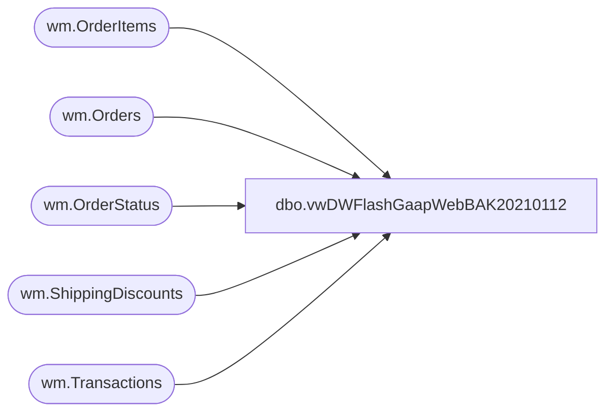

# dbo.vwDWFlashGaapWebBAK20210112

**Database:** WebOrderProcessing  
**Server:** bearcluster01  

## Architecture Diagram



## Table Dependencies

| Referenced Table |
|---|
| wm.OrderItems |
| wm.Orders |
| wm.OrderStatus |
| wm.ShippingDiscounts |
| wm.Transactions |

## View Code

```sql
CREATE view [dbo].[vwDWFlashGaapWebBAK20210112]

as

with
OrderShipping as
	(
		select 
			o.OrderID,
			sum(o.ShippingAmount) OrderShipping
		from wm.Orders o
		group by o.OrderId
	),
ShippingDiscounts as
	(
		select 
			OrderID,
			sum(DiscountAmount) ShippingDiscount
		from wm.ShippingDiscounts
		group by OrderID
	),
Shipping as
	(
		select
			os.OrderID,
			os.OrderShipping-isnull(sd.ShippingDiscount,0) as Shipping
		from OrderShipping os
		left join ShippingDiscounts sd on os.OrderID=sd.OrderID
	),
SalesTransactionSite as
	(
		select distinct 
			t.TransactionID,
			case
				when isnull(o.PickupStore,'') in ('0013', '2013') or isnull(o.PickupStore,'') = ''
				then 
					case
						when right(o.SourceSite,2) = 'US' then '0013'
						when right(o.SourceSite,2) = 'UK' then '2013'
					end
				else o.PickupStore
			end as LocationCode,
			case
				when isnull(o.PickupStore,'') in ('0013', '2013') or isnull(o.PickupStore,'') = ''
				then 
					case
						when right(o.SourceSite,2) = 'US' then 'US Web'
						when right(o.SourceSite,2) = 'UK' then 'UK Web'
					end
				--else concat('Store - ', o.PickupStore)
				else o.PickupStore
			end as LocationName,			
			case
				when isnull(o.PickupStore,'') in ('0013', '2013') or isnull(o.PickupStore,'') = ''
				then 
					case
						when right(o.SourceSite,2) = 'US' then 13
						when right(o.SourceSite,2) = 'UK' then 2013
					end
				else o.PickupStore
			end as StoreNumber,
			t.TransactionNum,
			case
				when isnull(o.PickupStore,'') in ('0013', '2013') or isnull(o.PickupStore,'') = ''
					then 0
				else 1
			end as isBOSISorBOPIS,
			--sum(oi.DiscountedPrice) as TotalCharges,
			sum(oi.DiscountedPrice) + s.Shipping as TotalCharges,
			os.StatusDate ShipDate
		from wm.Transactions t with (nolock)
		join wm.Orders o with (nolock) on t.TransactionID = o.TransactionID
		join wm.OrderStatus os with (nolock)
			on o.OrderID=os.OrderID
			and os.CurrentStatus=1
			and os.Status in ('Shipped','Complete')
		join wm.OrderItems oi with (nolock) 
			on o.orderID=oi.OrderID
			and oi.GiftCardNumber is NULL
			and len(oi.sku) = 6
		left join Shipping s on os.OrderID=s.OrderID
		where datediff(dd, os.StatusDate, getdate()) <= 90
		group by 
			t.TransactionID,
			case
				when isnull(o.PickupStore,'') in ('0013', '2013') or isnull(o.PickupStore,'') = ''
				then 
					case
						when right(o.SourceSite,2) = 'US' then '0013'
						when right(o.SourceSite,2) = 'UK' then '2013'
					end
				else o.PickupStore
			end,
			case
				when isnull(o.PickupStore,'') in ('0013', '2013') or isnull(o.PickupStore,'') = ''
				then 
					case
						when right(o.SourceSite,2) = 'US' then 'US Web'
						when right(o.SourceSite,2) = 'UK' then 'UK Web'
					end
				--else concat('Store - ', o.PickupStore)
				else o.PickupStore
			end,			
			case
				when isnull(o.PickupStore,'') in ('0013', '2013') or isnull(o.PickupStore,'') = ''
				then 
					case
						when right(o.SourceSite,2) = 'US' then 13
						when right(o.SourceSite,2) = 'UK' then 2013
					end
				else o.PickupStore
			end,
			t.TransactionNum,
			case
				when isnull(o.PickupStore,'') in ('0013', '2013') or isnull(o.PickupStore,'') = ''
					then 0
				else 1
			end,
			os.StatusDate,
			s.shipping
	)
select
	ts.TransactionID,
	ts.LocationCode,
	ts.LocationName,
	ts.StoreNumber,
	ts.TransactionNum as OrderNumber,
	--case 
	--	when ts.StoreNumber like '2___' 
	--		then dateadd(hh, +6, ts.ShipDate)
	--	else ts.ShipDate
	--end as TransactionDate, --for uk setting to uk time?
	ts.ShipDate as TransactionDate,
	ts.TotalCharges,
	ts.isBOSISorBOPIS
from SalesTransactionSite ts
```

