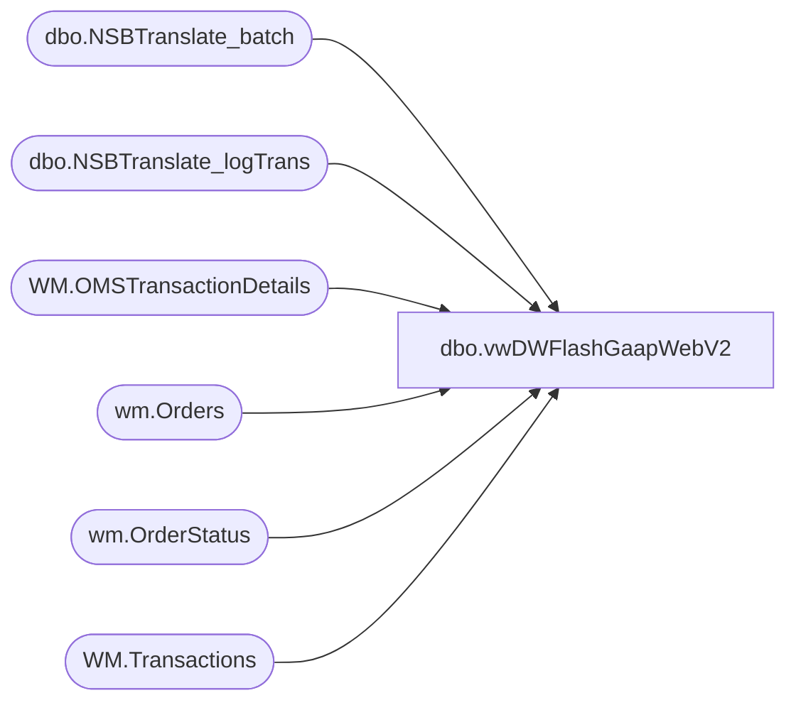

# dbo.vwDWFlashGaapWebV2

**Database:** WebOrderProcessing  
**Server:** bearcluster01  

## Architecture Diagram



## Table Dependencies

| Referenced Table |
|---|
| dbo.NSBTranslate_batch |
| dbo.NSBTranslate_logTrans |
| WM.OMSTransactionDetails |
| wm.Orders |
| wm.OrderStatus |
| WM.Transactions |

## View Code

```sql
CREATE view [dbo].[vwDWFlashGaapWebV2]

as


With
ShippedOrders as
	(
			select 
				t.sOrderNumber SettledOrderNumber
			 from BABWeCommerce.dbo.NSBTranslate_logTrans t
				join BABWeCommerce.dbo.NSBTranslate_batch b on t.sBatchID=b.sBatchID
			where b.bSentToAW = 1 
				--and datediff(dd, t.dTimeStamp, getdate())<= 200
			group by 
				t.sOrderNumber
	),
Orders as
	(
		select distinct 
			o.TransactionID,
			o.OrderNumber,
			o.OrderNum,
			o.PickupStore FulfillmentLocation,
			case when o.ShippingMethod = 'InStore' then 1 else 0 end as isPickupFromStore, 
			case when o.ShippingMethod = 'curbSide' then 1 else 0 end as isCurbside,
			case when o.ShippingMethod not in ('InStore', 'curbSide', 'sameDay') then 1 else 0 end as isShipFromStore,
			case when o.ShippingMethod = 'sameDay' then 1 else 0 end as isSameDay,
			o.SourceSite,
			o.ShipmentNumber
		from  wm.Orders o with (nolock) 
		join  wm.OrderStatus os with (nolock)
			on o.OrderID=os.OrderID
			and os.CurrentStatus=1
		where 1=1
		--and datediff(dd, os.StatusDate, getdate()) <= 200
		and o.OrderNum in (select SettledOrderNumber from ShippedOrders)
		and o.OrderStatus IN ('Complete', 'Shipped', 'StorePickedForPickup')
			and o.ShippingMethod not in ('donationShipping')
	),
TransactionDetailPayments as
	(
		SELECT 
			td.TransactionID,
			td.OrderTransactionIdentifier,
			td.TransactionDate,
			td.Tax,
			td.PaymentTransactionType, 
			sum(td.TransactionAmount) TransactionAmount,
			count(*) UnitAmount,
			td.CurrencyMultiplier
		  FROM WM.OMSTransactionDetails td 
		  LEFT JOIN WM.Transactions t ON td.TransactionID = t.TransactionID
		  WHERE 1=1
		  and t.TransactionNum NOT LIKE '7_______' --???? are these not sent to sales audit?
		  AND td.PaymentTransactionType IN ('sales', 'return', 'credit')
		  AND td.isSAProcessed = 1
		  and OMSTransactionTYpe<>'GiftCard'---exclude giftcards from gaap
		  group by 
			td.TransactionID,
			td.OrderTransactionIdentifier,
			td.TransactionDate,
			td.Tax,
			td.PaymentTransactionType,
			td.CurrencyMultiplier
	),
PaymentSum as
	(
		select 
			TransactionID,
			TransactionDate,
			PaymentTransactionType,
			CurrencyMultiplier,
			sum(Tax) Tax,
			sum(TransactionAmount) TransactionAmount,
			sum(UnitAmount) UnitAmount
		from TransactionDetailPayments
		group by 
			TransactionID,
			TransactionDate,
			PaymentTransactionType,
			CurrencyMultiplier
	),
OrderInfo as
	(
		select 
			MAX(oo.OrderNum) AS OrderNumber, 
			td.TransactionID, 
			oo.FulfillmentLocation as PickupStore,
			MAX(oo.ShipmentNumber) AS ShipmentNumber, 
			oo.SourceSite
		from TransactionDetailPayments td
		join Orders oo on td.TransactionID=oo.TransactionID
		GROUP BY 
			td.TransactionID, 
			oo.FulfillmentLocation, 
			oo.SourceSite
	)
select 
	o.OrderID as TransactionID,
	tp.TransactionDate,
	oi.OrderNumber,
	oi.PickupStore FulfillmentLocation,
	case 
		when isnull(oi.PickupStore,'x') in ('x','0013', '2013')
			then oi.SourceSite
		else concat(oi.SourceSite, '-to-', oi.PickupStore)
	end as FulfillmentLocationName,
	tp.PaymentTransactionType TransactionType,
	(tp.Tax * tp.CurrencyMultiplier) as Tax,
	(tp.TransactionAmount * tp.CurrencyMultiplier) as TransactionAmount,
	tp.UnitAmount as UnitAmount,
	tp.TransactionAmount-tp.Tax as FlashGaapSales,
	case 
		when isnull(oi.PickupStore,'x') in ('x','0013', '2013')
			then 0
		else 1
	end as isBOSISorBOPIS,
	case 
		when tp.PaymentTransactionType in ('return', 'credit') 
			then 1
		else 0
	end as ReturnsRegister
from OrderInfo oi
join PaymentSum tp on oi.TransactionID=tp.TransactionID
join wm.Orders o with (nolock) on oi.OrderNumber=o.OrderNum


/*
With
TransactionDetailPayments as
	(
		SELECT 
			td.TransactionID,
			td.OrderTransactionIdentifier,
			td.TransactionDate,
			td.Tax,
			td.PaymentTransactionType, 
			sum(td.TransactionAmount) TransactionAmount,
			td.CurrencyMultiplier
		  FROM WebOrderProcessing.WM.OMSTransactionDetails td 
		  LEFT JOIN WebOrderProcessing.WM.Transactions t ON td.TransactionID = t.TransactionID
		  WHERE 1=1
		  and t.TransactionNum NOT LIKE '7_______' --???? are these not sent to sales audit?
		  AND td.PaymentTransactionType IN ('sales', 'return', 'credit')
		  AND td.isSAProcessed = 1
		  --and datediff(dd, td.TransactionDate, getdate()) <= 30
		  and OMSTransactionTYpe<>'GiftCard'---exclude giftcards from gaap
		  group by 
			td.TransactionID,
			td.OrderTransactionIdentifier,
			td.TransactionDate,
			td.Tax,
			td.PaymentTransactionType,
			td.CurrencyMultiplier
	),
PaymentSum as
	(
		select 
			TransactionID,
			TransactionDate,
			PaymentTransactionType,
			CurrencyMultiplier,
			sum(Tax) Tax,
			sum(TransactionAmount) TransactionAmount
		from TransactionDetailPayments
		group by 
			TransactionID,
			TransactionDate,
			PaymentTransactionType,
			CurrencyMultiplier
	),
OrderInfo as
	(
		select 
			MAX(o.OrderNum) AS OrderNumber, 
			td.TransactionID, 
			v.PickupStore, 
			MAX(o.ShipmentNumber) AS ShipmentNumber, 
			--v.OrderTransactionIdentifier,
			o.SourceSite
		from TransactionDetailPayments td
		JOIN WM.vwOrderOrderTransactionIdentifier AS v 
			ON td.TransactionID = v.TransactionID 
			AND td.OrderTransactionIdentifier = v.OrderTransactionIdentifier 
		join WM.Orders AS o 
			ON v.TransactionID = o.TransactionID 
			AND v.PickupStore = o.PickupStore 
			AND o.OrderStatus IN ('Complete', 'Shipped', 'StorePickedForPickup')
			and o.ShippingMethod not in ('donationShipping')
		GROUP BY 
			td.TransactionID, 
			v.PickupStore, 
			--v.OrderTransactionIdentifier,
			o.SourceSite
	)
select 
	o.OrderID as TransactionID,
	tp.TransactionDate,
	oi.OrderNumber,
	oi.PickupStore FulfillmentLocation,
	case 
		when isnull(oi.PickupStore,'x') in ('x','0013', '2013')
			then oi.SourceSite
		else concat(oi.SourceSite, '-to-', oi.PickupStore)
	end as FulfillmentLocationName,
	tp.PaymentTransactionType TransactionType,
	(tp.Tax * tp.CurrencyMultiplier) as Tax,
	(tp.TransactionAmount * tp.CurrencyMultiplier) as TransactionAmount,
	--case 
	--	when oi.SourceSite='BABW-UK'
	--		then tp.TransactionAmount-tp.Tax
	--	else tp.TransactionAmount
	--end * tp.CurrencyMultiplier as FlashGaapSales,
	tp.TransactionAmount-tp.Tax as FlashGaapSales,
	case 
		when isnull(oi.PickupStore,'x') in ('x','0013', '2013')
			then 0
		else 1
	end as isBOSISorBOPIS,
	case 
		when tp.PaymentTransactionType in ('return', 'credit') 
			then 1
		else 0
	end as ReturnsRegister
from OrderInfo oi
join PaymentSum tp on oi.TransactionID=tp.TransactionID
join wm.Orders o with (nolock) on oi.OrderNumber=o.OrderNum
GO


*/
```

