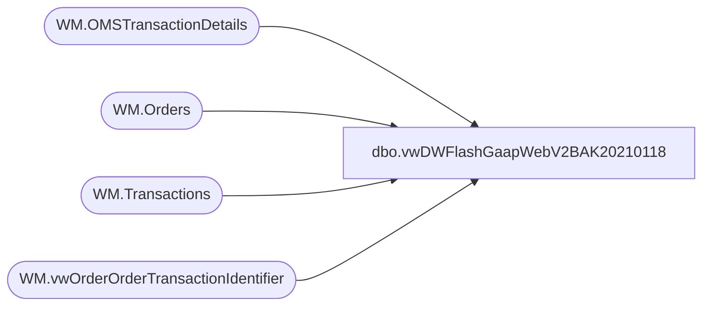

# dbo.vwDWFlashGaapWebV2BAK20210118

**Database:** WebOrderProcessing  
**Server:** bearcluster01  

## Architecture Diagram



## Table Dependencies

| Referenced Table |
|---|
| WM.OMSTransactionDetails |
| WM.Orders |
| WM.Transactions |
| WM.vwOrderOrderTransactionIdentifier |

## View Code

```sql
CREATE view [dbo].[vwDWFlashGaapWebV2BAK20200118]

as

With
TransactionDetailPayments as
	(
		SELECT 
			td.TransactionID,
			td.OrderTransactionIdentifier,
			td.TransactionDate,
			td.Tax,
			td.PaymentTransactionType, 
			sum(td.TransactionAmount) TransactionAmount,
			td.CurrencyMultiplier
		  FROM WebOrderProcessing.WM.OMSTransactionDetails td 
		  LEFT JOIN WebOrderProcessing.WM.Transactions t ON td.TransactionID = t.TransactionID
		  WHERE 1=1
		  and t.TransactionNum NOT LIKE '7_______' --???? are these not sent to sales audit?
		  AND td.PaymentTransactionType IN ('sales', 'return', 'credit')
		  AND td.isSAProcessed = 1
		  --and datediff(dd, td.TransactionDate, getdate()) <= 30
		  and OMSTransactionTYpe<>'GiftCard'---exclude giftcards from gaap
		  group by 
			td.TransactionID,
			td.OrderTransactionIdentifier,
			td.TransactionDate,
			td.Tax,
			td.PaymentTransactionType,
			td.CurrencyMultiplier
	),
PaymentSum as
	(
		select 
			TransactionID,
			TransactionDate,
			PaymentTransactionType,
			CurrencyMultiplier,
			sum(Tax) Tax,
			sum(TransactionAmount) TransactionAmount
		from TransactionDetailPayments
		group by 
			TransactionID,
			TransactionDate,
			PaymentTransactionType,
			CurrencyMultiplier
	),
OrderInfo as
	(
		select 
			MAX(o.OrderNum) AS OrderNumber, 
			td.TransactionID, 
			v.PickupStore, 
			MAX(o.ShipmentNumber) AS ShipmentNumber, 
			--v.OrderTransactionIdentifier,
			o.SourceSite
		from TransactionDetailPayments td
		JOIN WM.vwOrderOrderTransactionIdentifier AS v 
			ON td.TransactionID = v.TransactionID 
			AND td.OrderTransactionIdentifier = v.OrderTransactionIdentifier 
		join WM.Orders AS o 
			ON v.TransactionID = o.TransactionID 
			AND v.PickupStore = o.PickupStore 
			AND o.OrderStatus IN ('Complete', 'Shipped', 'StorePickedForPickup')
			and o.ShippingMethod not in ('donationShipping')
		GROUP BY 
			td.TransactionID, 
			v.PickupStore, 
			--v.OrderTransactionIdentifier,
			o.SourceSite
	)
select 
	o.OrderID as TransactionID,
	tp.TransactionDate,
	oi.OrderNumber,
	oi.PickupStore FulfillmentLocation,
	case 
		when isnull(oi.PickupStore,'x') in ('x','0013', '2013')
			then oi.SourceSite
		else concat(oi.SourceSite, '-to-', oi.PickupStore)
	end as FulfillmentLocationName,
	tp.PaymentTransactionType TransactionType,
	(tp.Tax * tp.CurrencyMultiplier) as Tax,
	(tp.TransactionAmount * tp.CurrencyMultiplier) as TransactionAmount,
	--case 
	--	when oi.SourceSite='BABW-UK'
	--		then tp.TransactionAmount-tp.Tax
	--	else tp.TransactionAmount
	--end * tp.CurrencyMultiplier as FlashGaapSales,
	tp.TransactionAmount-tp.Tax as FlashGaapSales,
	case 
		when isnull(oi.PickupStore,'x') in ('x','0013', '2013')
			then 0
		else 1
	end as isBOSISorBOPIS,
	case 
		when tp.PaymentTransactionType in ('return', 'credit') 
			then 1
		else 0
	end as ReturnsRegister
from OrderInfo oi
join PaymentSum tp on oi.TransactionID=tp.TransactionID
join wm.Orders o with (nolock) on oi.OrderNumber=o.OrderNum

dbo,vwdynamics_serviceitemlookup,CREATE VIEW vwdynamics_serviceitemlookup
AS

with DataStage as (
SELECT '000014' AS itemnumber,
    'SV022610' AS dynamicsitemid
UNION
 SELECT '000015' AS itemnumber,
    'SV022610' AS dynamicsitemid
UNION
 SELECT '000016' AS itemnumber,
    'SV022610' AS dynamicsitemid
UNION
 SELECT '000017' AS itemnumber,
    'SV022610' AS dynamicsitemid
UNION
 SELECT '000025' AS itemnumber,
    'SV000025' AS dynamicsitemid
UNION
 SELECT '000032' AS itemnumber,
    'SV000032' AS dynamicsitemid
UNION
 SELECT '018079' AS itemnumber,
    'SV022610' AS dynamicsitemid
UNION
 SELECT '018084' AS itemnumber,
    'SV022610' AS dynamicsitemid
UNION
 SELECT '022610' AS itemnumber,
    'SV022610' AS dynamicsitemid
UNION
 SELECT '028144' AS itemnumber,
    'SV028144' AS dynamicsitemid
UNION
 SELECT '080731' AS itemnumber,
    'SV080731' AS dynamicsitemid
UNION
 SELECT '091450' AS itemnumber,
    'SV091450' AS dynamicsitemid
UNION
 SELECT '098041' AS itemnumber,
    'SV098041' AS dynamicsitemid
UNION
 SELECT '098044' AS itemnumber,
    'SV098044' AS dynamicsitemid
UNION
 SELECT '098075' AS itemnumber,
    'SV098075' AS dynamicsitemid
UNION
 SELECT '098088' AS itemnumber,
    'SV098088' AS dynamicsitemid
UNION
 SELECT '198075' AS itemnumber,
    'SV198075' AS dynamicsitemid
UNION
 SELECT '400003' AS itemnumber,
    'SV400003' AS dynamicsitemid
UNION
 SELECT '480200' AS itemnumber,
    'SV480200' AS dynamicsitemid
UNION
 SELECT '491450' AS itemnumber,
    'SV491450' AS dynamicsitemid
UNION
 SELECT '491451' AS itemnumber,
    'SV491451' AS dynamicsitemid
UNION
 SELECT '498033' AS itemnumber,
    'SV498033' AS dynamicsitemid
UNION
 SELECT '498041' AS itemnumber,
    'SV498041' AS dynamicsitemid
UNION
 SELECT '498088' AS itemnumber,
    'SV498088' AS dynamicsitemid
UNION
 SELECT '000024' AS itemnumber,
    'SV000024' AS dynamicsitemid
UNION
 SELECT '000026' AS itemnumber,
    'SV000026' AS dynamicsitemid
UNION
 SELECT '000027' AS itemnumber,
    'SV000027' AS dynamicsitemid
UNION
 SELECT '000029' AS itemnumber,
    'SV000029' AS dynamicsitemid
UNION
 SELECT '000035' AS itemnumber,
    'SV000035' AS dynamicsitemid
UNION
 SELECT '000042' AS itemnumber,
    'SV000042' AS dynamicsitemid
UNION
 SELECT '000044' AS itemnumber,
    'SV000044' AS dynamicsitemid
UNION
 SELECT '000077' AS itemnumber,
    'SV000077' AS dynamicsitemid
UNION
 SELECT '000078' AS itemnumber,
    'SV000078' AS dynamicsitemid
UNION
 SELECT '000081' AS itemnumber,
    'SV000081' AS dynamicsitemid
UNION
 SELECT '000082' AS itemnumber,
    'SV000082' AS dynamicsitemid
UNION
 SELECT '080726' AS itemnumber,
    'SV080726' AS dynamicsitemid
UNION
 SELECT '080727' AS itemnumber,
    'SV080727' AS dynamicsitemid
UNION
 SELECT '080728' AS itemnumber,
    'SV080728' AS dynamicsitemid
UNION
 SELECT '080729' AS itemnumber,
    'SV080729' AS dynamicsitemid
UNION
 SELECT '080730' AS itemnumber,
    'SV080730' AS dynamicsitemid
UNION
 SELECT '080733' AS itemnumber,
    'SV080733' AS dynamicsitemid
UNION
 SELECT '080736' AS itemnumber,
    'SV080736' AS dynamicsitemid
UNION
 SELECT '080738' AS itemnumber,
    'SV080738' AS dynamicsitemid
UNION
 SELECT '080741' AS itemnumber,
    'SV080741' AS dynamicsitemid
UNION
 SELECT '098042' AS itemnumber,
    'SV098042' AS dynamicsitemid
UNION
 SELECT '098043' AS itemnumber,
    'SV098043' AS dynamicsitemid
UNION
 SELECT '480731' AS itemnumber,
    'SV480731' AS dynamicsitemid

)

Select 
ds.itemnumber as ItemNumber
, ds.dynamicsitemid as DynamicsItemId
from DataStage ds
```

