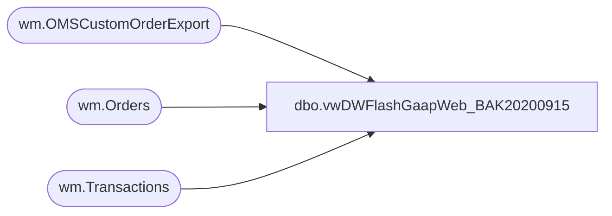

# dbo.vwDWFlashGaapWeb_BAK20200915

**Database:** WebOrderProcessing  
**Server:** bearcluster01  

## Architecture Diagram



## Table Dependencies

| Referenced Table |
|---|
| wm.OMSCustomOrderExport |
| wm.Orders |
| wm.Transactions |

## View Code

```sql
CREATE view [dbo].[vwDWFlashGaapWeb_BAK20200915] as


with
SalesTransactionSite as
	(
		select distinct 
			t.TransactionID,
			case when right(o.SourceSite,2) = 'US' then '0013' else '2013' end as LocationCode,
			case when right(o.SourceSite,2) = 'US' then 'US Web' else 'UK Web' end as LocationName,
			case when right(o.SourceSite,2) = 'US' then 13 else 2013 end as StoreNumber,
			t.TransactionNum
		from wm.Transactions t with (nolock)
		join wm.Orders o with (nolock) on t.TransactionID = o.TransactionID
		where datediff(dd, t.TransactionDateTime, getdate()) <= 90
	),
SalesData as
	(
		select
			od.TransactionID, 
			--max(dateadd(hh, -6, od.OrderItemStatusChangeDateUTC)) as TransactionDate,
			max(od.OrderItemStatusChangeDateUTC) as TransactionDate,
			od.OrderNetTotal as TotalCharges
		from wm.OMSCustomOrderExport od with (nolock)
		where 1=1
		--and datediff(dd, dateadd(hh, -6, od.OrderItemStatusChangeDateUTC), getdate()) <= 90
		and datediff(dd, od.OrderItemStatusChangeDateUTC, getdate()) <= 90
		and od.OrderStatus = 'Completed' 
		and od.ItemStatus = 'Shipped'
		and od.OrderItemTypeName='Regular Item'
		group by 
			od.TransactionID, 
			od.OrderNetTotal
	),
ReturnsData as
	(
		select
			od.TransactionID, 
			--max(dateadd(hh, -6, od.OrderItemStatusChangeDateUTC)) as TransactionDate,
			max(od.OrderItemStatusChangeDateUTC) as TransactionDate,
			(od.OrderNetTotal * -1) as TotalCharges
		from wm.OMSCustomOrderExport od with (nolock)
		where 1=1
		--and datediff(dd, dateadd(hh, -6, od.OrderItemStatusChangeDateUTC), getdate()) <= 90
		and datediff(dd, od.OrderItemStatusChangeDateUTC, getdate()) <= 90
		and od.OrderStatus = 'Completed' 
		and od.ItemStatus = 'Return'
		and od.OrderItemTypeName='Regular Item'
		group by 
			od.TransactionID, 
			od.OrderNetTotal
	),
ReturnsTransactionSite as
	(
		select distinct 
			t.TransactionID,
			case when right(o.SourceSite,2) = 'US' then '0013' else '2013' end as LocationCode,
			case when right(o.SourceSite,2) = 'US' then 'US Web' else 'UK Web' end as LocationName,
			case when right(o.SourceSite,2) = 'US' then 13 else 2013 end as StoreNumber,
			t.TransactionNum
		from wm.Transactions t with (nolock)
		join wm.Orders o with (nolock) on t.TransactionID = o.TransactionID
		join ReturnsData rd on rd.TransactionID = t.TransactionID
	)
select
	ts.TransactionID,
	ts.LocationCode,
	ts.LocationName,
	ts.StoreNumber,
	ts.TransactionNum as OrderNumber,
	case 
		when ts.StoreNumber = 13 
			then dateadd(hh, -6, sd.TransactionDate)
		else sd.TransactionDate
	end as TransactionDate,
	sd.TotalCharges 
from SalesTransactionSite ts
join SalesData sd on ts.TransactionID=sd.TransactionID
where ts.StoreNumber in ('0013', '2013')
UNION ALL
select
	ts.TransactionID,
	ts.LocationCode,
	ts.LocationName,
	ts.StoreNumber,
	ts.TransactionNum as OrderNumber,
	case 
		when ts.StoreNumber = 13 
			then dateadd(hh, -6, rd.TransactionDate)
		else rd.TransactionDate
	end as TransactionDate,
	rd.TotalCharges 
from ReturnsTransactionSite ts
join ReturnsData rd on ts.TransactionID=rd.TransactionID
where ts.StoreNumber in ('0013', '2013')
```

