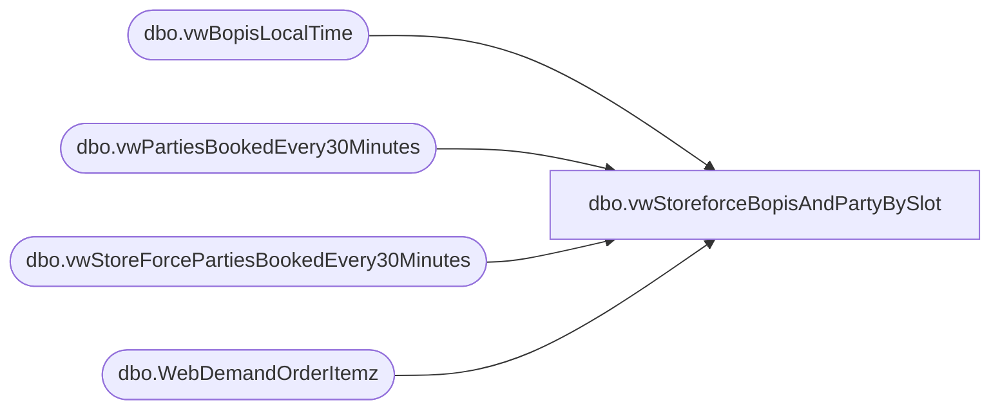

# dbo.vwStoreforceBopisAndPartyBySlot

**Database:** WebOrderProcessing  
**Server:** bearcluster01  

## Architecture Diagram



## Table Dependencies

| Referenced Table |
|---|
| dbo.vwBopisLocalTime |
| dbo.vwPartiesBookedEvery30Minutes |
| dbo.vwStoreForcePartiesBookedEvery30Minutes |
| dbo.WebDemandOrderItemz |

## View Code

```sql
CREATE view [dbo].[vwStoreforceBopisAndPartyBySlot]

as

with 
Timeslots as
	(
		select distinct PartyBookDateRaw as DateRaw, 
		PartyBookDate as DateFormatted,
		StoreID, Slot
		from BABWPartyPlanner.dbo.vwStoreForcePartiesBookedEvery30Minutes --vwPartiesBookedEvery30Minutes p
		where datediff(dd, PartyBookDateRaw, getdate())=0
		union
		select distinct cast(b.LastUpdateDateLocal as date) DateRaw, 
		--convert(varchar, b.LastUpdateDateLocal, 103) DateFormatted,
		format(b.LastUpdateDateLocal,'d/M/yyyy') as DateFormatted,
		b.StoreCode, b.LocalTimeSlot
		from vwBopisLocalTime b 
		join WebDemandOrderItemz oi on b.OrderNumber=oi.OrderNumber 
		where datediff(dd, b.LastUpdateDateLocal, getdate())=0
	),
Bopis as 
	(
		select 
			b.StoreCode, 
			cast(b.LastUpdateDateLocal as date) TransactionDateRaw,
			--convert(varchar, b.LastUpdateDateLocal, 103) as TransactionDateConverted,
			format(b.LastUpdateDateLocal,'d/M/yyyy') as TransactionDateConverted,
			b.LocalTimeSlot,
			case when b.DeliveryType='Omni Pickup' then count(distinct b.OrderNumber) else 0 end as PickupFromStoreOrders,
			case when b.DeliveryType='Omni Pickup' then sum(oi.SubTotal) else 0 end as PickupFromStoreSales, -- excludes tax
			case when b.DeliveryType='Omni Pickup' then sum(cast(oi.Quantity as int)) else 0 end as PickupFromStoreUnits,

			case when b.DeliveryType='Omni Ship' then count(distinct b.OrderNumber) else 0 end as ShipFromStoreOrders,
			case when b.DeliveryType='Omni Ship' then sum(oi.SubTotal) else 0 end as ShipFromStoreSales, -- excludes tax
			case when b.DeliveryType='Omni Ship' then sum(cast(oi.Quantity as int)) else 0 end as ShipFromStoreUnits
		from vwBopisLocalTime b 
		join WebDemandOrderItemz oi on b.OrderNumber=oi.OrderNumber 
		where datediff(dd, b.LastUpdateDateLocal, getdate())=0
		and oi.ItemStatus in 
			(
				'Store Shipped',
				'Return',
				'Shipped',
				'Picked Up',
				'Delivered'
			)
		group by 
			b.StoreCode, 
			cast(b.LastUpdateDateLocal as date),
			--convert(varchar, b.LastUpdateDateLocal, 103),
			format(b.LastUpdateDateLocal,'d/M/yyyy'),
			b.LocalTimeSlot,
			b.DeliveryType
	)
select 
	ts.DateFormatted, 
	ts.StoreID,
	ts.Slot,
	isnull(b.PickupFromStoreOrders,0) PickupFromStoreOrders,	
	isnull(b.PickupFromStoreSales,0) PickupFromStoreSales,
	isnull(b.PickupFromStoreUnits,0) PickupFromStoreUnits,	
	isnull(b.ShipFromStoreOrders,0) ShipFromStoreOrders,	
	isnull(b.ShipFromStoreSales,0) ShipFromStoreSales,	
	isnull(b.ShipFromStoreUnits,0) ShipFromStoreUnits,
	isnull(p.PartiesBooked,0) PartiesBooked

from Timeslots ts 
left join BABWPartyPlanner.dbo.vwPartiesBookedEvery30Minutes p
	on ts.DateRaw=p.PartyBookDateRaw
	and ts.StoreID=p.StoreID
	and ts.Slot=p.Slot
	and datediff(dd, PartyBookDateRaw, getdate())=0
left join bopis b 
	on ts.DateRaw=b.TransactionDateRaw
	and ts.StoreID=b.StoreCode
	and ts.Slot=b.LocalTimeSlot

dbo,vwTMPBrokenUKXPOrders,CREATE VIEW dbo.vwTMPBrokenUKXPOrders
AS
SELECT        o.OrderId, o.TransactionID, o.OrderNum, o.EnterpriseSellingID, o.OrderDate, o.OrderStatus, o.OrderType, o.PickupStore, o.OrderAuthentication, o.SourceSite, o.BatchNo, o.SequenceNo, o.DatePrinted, o.HouseOrder, 
                         o.HouseOrderReason, o.GiftSender, o.GiftMessage, o.SpecialInstructions, o.ServiceRep, o.BillToFName, o.BillToLName, o.BillToAddress1, o.BillToAddress2, o.BillToCity, o.BillToState, o.BillToPostalCode, o.BillToCountry, 
                         o.BillToPhone, o.BillToEmail, o.ShipToFName, o.ShipToLName, o.ShipToAddress1, o.ShipToAddress2, o.ShipToCity, o.ShipToState, o.ShipToPostalCode, o.ShipToCountry, o.ShipToPhone, o.ShipToEmail, o.ShippingAmount, 
                         o.ShippingMethod, o.PickTicketFlag, o.OrderNumber, o.ShipmentNumber
FROM            WM.Orders AS o INNER JOIN
                         dbo.BrokenUKXP AS x ON o.OrderNumber = x.OrderNumber AND o.ShipmentNumber > 0
```

