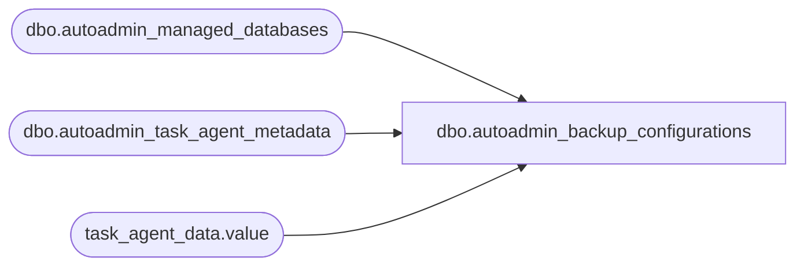

# dbo.autoadmin_backup_configurations

**Database:** msdb  
**Server:** bearcluster01  

## Architecture Diagram



## Table Dependencies

| Referenced Table |
|---|
| dbo.autoadmin_managed_databases |
| dbo.autoadmin_task_agent_metadata |
| task_agent_data.value |

## View Code

```sql
----------------------------------------------------------------------------------------------------
--                              autoadmin_backup_configurations
--
-- Contains the current configuration for all databases as well as the system configuration.
-- This spans all managed backup versions to make telemetry collection simple
--
CREATE VIEW autoadmin_backup_configurations
AS
WITH XMLNAMESPACES (N'http://schemas.datacontract.org/2004/07/Microsoft.SqlServer.SmartAdmin.SmartBackupAgent' AS sb)
SELECT
aamd.db_id as db_id,
schema_version as ManagedBackupVersion,
CASE 
	WHEN aamd.group_db_guid IS NULL
	THEN CONVERT(BIT, 'false')
	ELSE CONVERT(BIT, 'true')
END as IsAlwaysOn,
CASE 
	WHEN aamd.drop_date IS NULL 
	THEN CONVERT(BIT, 'false')
	ELSE CONVERT(BIT, 'true')
END as IsDropped,
CONVERT(BIT, aatm.task_agent_data.value('(/*/autoBackupSetting)[1]', 'nvarchar(32)')) AS IsEnabled,
NULLIF(aatm.task_agent_data.value('(/*/retentionPeriod)[1]', 'int'), 0) AS RetentionPeriod,
NULLIF(aatm.task_agent_data.value('(/*/encryptionAlgorithm)[1]', 'nvarchar(128)'), '') AS EncryptionAlgorithm,
NULLIF(aatm.task_agent_data.value('(/*/schedulingOption)[1]', 'nvarchar(128)'), '') AS SchedulingOption,
NULLIF(aatm.task_agent_data.value('(/*/daysOfWeek)[1]', 'nvarchar(256)'), '') AS DayOfWeek
FROM
	autoadmin_managed_databases aamd 
	JOIN autoadmin_task_agent_metadata aatm ON aamd.autoadmin_id = aatm.autoadmin_id
WHERE
	aatm.task_agent_guid = '6DF5825B-945C-4081-A4E3-292556E99B99'
	AND aamd.autoadmin_id <> 0
UNION ALL
SELECT
NULL AS db_id,
schema_version AS ManagedBackupVersion,
NULL AS IsAlwaysOn,
NULL AS IsDropped,
CONVERT(BIT, aatm.task_agent_data.value('(/*/sb:defaultAutoBackupSetting)[1]', 'nvarchar(32)')) AS IsEnabled,
NULLIF(aatm.task_agent_data.value('(/*/sb:defaultRetentionPeriod)[1]', 'int'), 0) AS RetentionPeriod,
NULLIF(aatm.task_agent_data.value('(/*/sb:defaultEncryptionAlgorithm)[1]', 'nvarchar(128)'), '') AS EncryptionAlgorithm,
NULLIF(aatm.task_agent_data.value('(/*/sb:defaultSchedulingOption)[1]', 'nvarchar(128)'), '') AS SchedulingOption,
NULLIF(aatm.task_agent_data.value('(/*/sb:defaultDaysOfWeek)[1]', 'nvarchar(256)'), '') AS DayOfWeek
FROM autoadmin_task_agent_metadata aatm
WHERE
	task_agent_guid = '6DF5825B-945C-4081-A4E3-292556E99B99'
	AND autoadmin_id = 0

dbo,MSdatatype_mappings,CREATE VIEW dbo.MSdatatype_mappings (dbms_name, sql_type, dest_type, dest_prec, dest_create_params, dest_nullable) AS SELECT destination_dbms, source_type, destination_type, case when (destination_createparams & 1) = 1 then destination_precision else destination_length end, destination_createparams, destination_nullable FROM sys.fn_helpdatatypemap(N'MSSQLSERVER', '%', '%', '%', '%', '%', 0)
```

