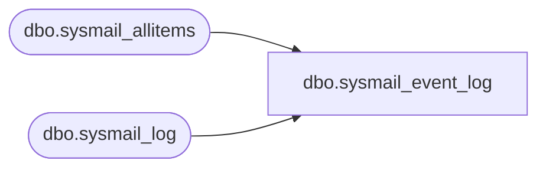

# dbo.sysmail_event_log

**Database:** msdb  
**Server:** bearcluster01  

## Architecture Diagram



## Table Dependencies

| Referenced Table |
|---|
| dbo.sysmail_allitems |
| dbo.sysmail_log |

## View Code

```sql
CREATE VIEW sysmail_event_log
AS
SELECT log_id,
       CASE event_type 
          WHEN 0 THEN 'success' 
          WHEN 1 THEN 'information' 
          WHEN 2 THEN 'warning' 
          ELSE 'error' 
       END as event_type,
       log_date,
       description,
       process_id,
       sl.mailitem_id,
       account_id,
       sl.last_mod_date,
       sl.last_mod_user
FROM [dbo].[sysmail_log]  sl
WHERE (ISNULL(IS_SRVROLEMEMBER(N'sysadmin'), 0) = 1) OR 
      (EXISTS ( SELECT mailitem_id FROM [dbo].[sysmail_allitems] ai WHERE sl.mailitem_id = ai.mailitem_id ))
```

