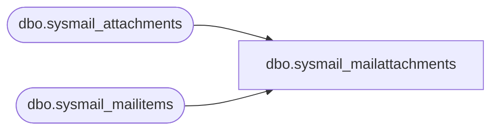

# dbo.sysmail_mailattachments

**Database:** msdb  
**Server:** bearcluster01  

## Architecture Diagram



## Table Dependencies

| Referenced Table |
|---|
| dbo.sysmail_attachments |
| dbo.sysmail_mailitems |

## View Code

```sql
CREATE VIEW sysmail_mailattachments
AS
SELECT attachment_id,
       sa.mailitem_id,
       filename,
       filesize,
       attachment,
       sa.last_mod_date,
       sa.last_mod_user
  FROM msdb.dbo.sysmail_attachments sa
  JOIN msdb.dbo.sysmail_mailitems sm ON sa.mailitem_id = sm.mailitem_id
  WHERE (sm.send_request_user = SUSER_SNAME()) OR (ISNULL(IS_SRVROLEMEMBER(N'sysadmin'), 0) = 1)
```

