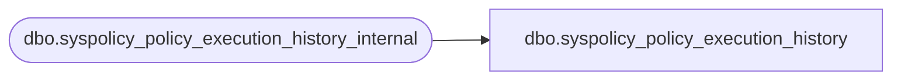

# dbo.syspolicy_policy_execution_history

**Database:** msdb  
**Server:** bearcluster01  

## Architecture Diagram



## Table Dependencies

| Referenced Table |
|---|
| dbo.syspolicy_policy_execution_history_internal |

## View Code

```sql
CREATE VIEW [dbo].[syspolicy_policy_execution_history]
AS
    SELECT 
        history_id,
        policy_id,
        start_date,
        end_date,
        result,
        exception_message,
        exception
    FROM [dbo].[syspolicy_policy_execution_history_internal]
```

