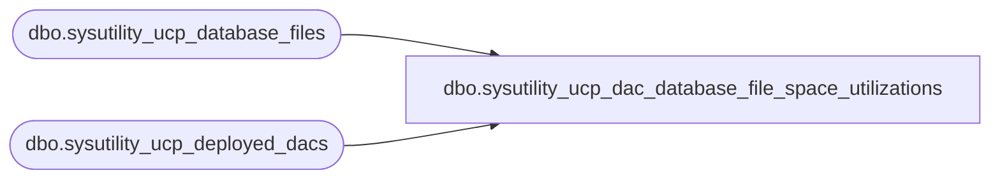

# dbo.sysutility_ucp_dac_database_file_space_utilizations

**Database:** msdb  
**Server:** bearcluster01  

## Architecture Diagram



## Table Dependencies

| Referenced Table |
|---|
| dbo.sysutility_ucp_database_files |
| dbo.sysutility_ucp_deployed_dacs |

## View Code

```sql
CREATE VIEW [dbo].[sysutility_ucp_dac_database_file_space_utilizations] AS
    SELECT	dd.dac_server_instance_name AS server_instance_name, 
            dd.dac_name AS dac_name,
            df.[filegroup_name],
            df.[Name],
            df.volume_name,
            df.volume_device_id,
            df.FileName AS databasefile_name, 
            df.percent_utilization AS current_utilization, 
            df.UsedSpace AS used_space, 
            df.available_space,
            10 AS under_utilization, 
            70 AS over_utilization,
            df.file_type,
            df.GrowthType AS growth_type
    FROM	msdb.dbo.sysutility_ucp_deployed_dacs AS dd,
            msdb.dbo.sysutility_ucp_database_files AS df
    WHERE dd.dac_server_instance_name = df.server_instance_name
      AND dd.dac_name = df.database_name         

dbo,sysutility_ucp_dac_health,CREATE VIEW dbo.sysutility_ucp_dac_health 
AS
SELECT t.dac_name
	   , t.dac_server_instance_name
	   , (SELECT val FROM dbo.fn_sysutility_ucp_get_aggregated_health(t.is_volume_space_over_utilized, t.is_volume_space_under_utilized)) volume_space_health_state  
	   , (SELECT val FROM dbo.fn_sysutility_ucp_get_aggregated_health(t.is_computer_processor_over_utilized, t.is_computer_processor_under_utilized)) computer_processor_health_state  
	   , (SELECT val FROM dbo.fn_sysutility_ucp_get_aggregated_health(t.is_file_space_over_utilized, t.is_file_space_under_utilized)) file_space_health_state  
	   , (SELECT val FROM dbo.fn_sysutility_ucp_get_aggregated_health(t.is_dac_processor_over_utilized, t.is_dac_processor_under_utilized)) dac_processor_health_state  
	   , CASE WHEN (is_volume_space_over_utilized > 0) THEN CONVERT(BIT, 1) ELSE CONVERT(BIT, 0) END AS contains_over_utilized_volumes
	   , CASE WHEN (is_volume_space_under_utilized > 0) THEN CONVERT(BIT, 1) ELSE CONVERT(BIT, 0) END AS contains_under_utilized_volumes 
	   , CASE WHEN (is_file_space_over_utilized > 0) THEN CONVERT(BIT, 1) ELSE CONVERT(BIT, 0) END AS contains_over_utilized_filegroups
	   , CASE WHEN (is_file_space_under_utilized > 0) THEN CONVERT(BIT, 1) ELSE CONVERT(BIT, 0) END AS contains_under_utilized_filegroups
	   , t.is_policy_overridden
	   , t.processing_time
FROM msdb.dbo.sysutility_ucp_dac_health_internal AS t
WHERE t.set_number = (SELECT latest_health_state_id FROM [msdb].[dbo].[sysutility_ucp_processing_state_internal])

dbo,sysutility_ucp_dac_policies,CREATE VIEW dbo.sysutility_ucp_dac_policies AS
(    
    SELECT dp.dac_name
        , dp.dac_server_instance_name
        , dp.dac_urn
        , dp.powershell_path
        , ISNULL(lp.policy_id, dp.policy_id) AS policy_id -- if exists get local (overridden) policy, else return global policy 
        , ISNULL(lp.is_global_policy, 1) AS is_global_policy
        , dp.resource_type
        , dp.target_type
        , dp.utilization_type
    FROM 
        (
            -- fetch the global policies 
            SELECT dd.dac_name
                , dd.dac_server_instance_name 
                , dd.urn AS dac_urn
                , dd.powershell_path AS powershell_path
                , gp.policy_id
                , gp.resource_type
                , gp.target_type
                , gp.utilization_type
            FROM msdb.dbo.sysutility_ucp_deployed_dacs dd
                , msdb.dbo.sysutility_ucp_policies gp
            WHERE gp.rollup_object_type = 1  
                AND gp.is_global_policy = 1    
        ) dp
        LEFT JOIN msdb.dbo.sysutility_ucp_policies lp -- fetch the local policies (if exists)
        ON lp.rollup_object_urn = dp.dac_urn 
            AND lp.rollup_object_type = 1
            AND lp.is_global_policy = 0
            AND lp.resource_type = dp.resource_type
            AND lp.target_type = dp.target_type
            AND lp.utilization_type = dp.utilization_type
)

dbo,sysutility_ucp_dac_policy_type,CREATE VIEW dbo.sysutility_ucp_dac_policy_type AS
(    

    -- Target types
    -- computer_type = 1
    -- volume_type = 6

    -- Resource types
    -- processor_type = 3
    -- space_type = 1

    SELECT DISTINCT dd.dac_server_instance_name
	    , dd.dac_name
        , CASE WHEN ((0 < ip.is_policy_overridden) OR (0 < cp.is_policy_overridden)) THEN 1 ELSE 0 END AS is_policy_overridden
    FROM msdb.dbo.sysutility_ucp_deployed_dacs dd 
        , (SELECT dac_name, dac_server_instance_name, SUM(CASE WHEN 0 < is_global_policy THEN 0 ELSE 1 END) AS is_policy_overridden
           FROM msdb.dbo.sysutility_ucp_dac_policies 
           GROUP BY dac_name, dac_server_instance_name) ip 
        , (SELECT physical_server_name, SUM(CASE WHEN 0 < is_global_policy THEN 0 ELSE 1 END) AS is_policy_overridden
           FROM msdb.dbo.sysutility_ucp_computer_policies  
           GROUP BY physical_server_name) cp     
    WHERE ip.dac_name = dd.dac_name
        AND ip.dac_server_instance_name = dd.dac_server_instance_name
        AND cp.physical_server_name = dd.dac_physical_server_name	
)
```

