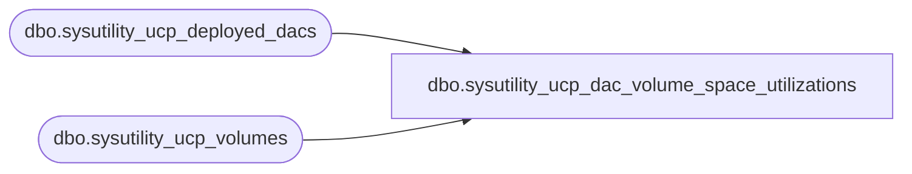

# dbo.sysutility_ucp_dac_volume_space_utilizations

**Database:** msdb  
**Server:** bearcluster01  

## Architecture Diagram



## Table Dependencies

| Referenced Table |
|---|
| dbo.sysutility_ucp_deployed_dacs |
| dbo.sysutility_ucp_volumes |

## View Code

```sql
CREATE VIEW [dbo].[sysutility_ucp_dac_volume_space_utilizations] AS(
-- TODO VSTS 280036(rnagpal) : Temporarily Keeping under_utilization to 10 and over_utilization to 70 for now
-- since we might reintroduce them in near future which will not require any interface change for the 
-- Utility object model / UI. Presently, we are not exposing under and over utilization thresholds in UI
-- so they are not exposed. If that remains the same till KJ CTP2, i'll remove them.
SELECT	vol.physical_server_name AS physical_server_name,
		dd.dac_name AS dac_name,
		dd.dac_server_instance_name AS server_instance_name, 
		vol.volume_name AS volume_name, 
		vol.volume_device_id AS volume_device_id, 
		vol.total_space_utilization AS current_utilization, 
		vol.total_space_used AS used_space,
		vol.total_space AS available_space,
		10 AS under_utilization, 
		70 AS over_utilization
		
FROM	msdb.dbo.sysutility_ucp_volumes AS vol,
		msdb.dbo.sysutility_ucp_deployed_dacs AS dd
		
WHERE	vol.physical_server_name = dd.dac_physical_server_name)

dbo,sysutility_ucp_database_files,CREATE VIEW dbo.sysutility_ucp_database_files
AS
        SELECT [S].[server_instance_name], [S].[database_name], [S].[filegroup_name], [S].[Name] AS [Name],
               [S].[volume_name], [S].[volume_device_id], [S].[FileName], [S].[Growth], [S].[GrowthType],
               [S].[processing_time], [S].[powershell_path],
               1 AS [file_type],
               [S].[MaxSize], [S].[Size], [S].[UsedSpace], [S].[available_space], [S].[percent_utilization]
        FROM [dbo].[sysutility_ucp_datafiles] AS S
        UNION ALL
        SELECT [S].[server_instance_name], [S].[database_name], N'' AS [filegroup_name], [S].[Name] AS [Name],
               [S].[volume_name], [S].[volume_device_id], [S].[FileName], [S].[Growth], [S].[GrowthType],
               [S].[processing_time], [S].[powershell_path],
               2 AS [file_type],
               [S].[MaxSize], [S].[Size], [S].[UsedSpace], [S].[available_space], [S].[percent_utilization]
        FROM [dbo].[sysutility_ucp_logfiles] AS S
```

