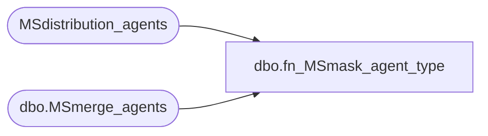

# dbo.fn_MSmask_agent_type

**Database:** CRDM_Distributor  
**Server:** bedrockdb01  
**Function Type:** Scalar Function  
**Returns:** int(4)  

## Architecture Diagram



## Parameters

| Parameter | Data Type | Max Length | Is Output |
|---|---|---|---|
| @agent_id | int | 4 | NO |
| @agent_type | int | 4 | NO |

## Table Dependencies

| Referenced Table |
|---|
| MSdistribution_agents |
| dbo.MSmerge_agents |

## Function Code

```sql
create function dbo.fn_MSmask_agent_type(
    @agent_id int,
	@agent_type int
    ) returns int
as
begin
	declare @anonymous_mask int
	select @anonymous_mask = 0x80000000
	if @agent_type = 3 -- If dist agent
	begin
		if exists (select * from MSdistribution_agents where id = @agent_id and 
			subscriber_name is not null)
			select @agent_type = 3 | @anonymous_mask
		else
			select @agent_type = 3 
	end
	else if @agent_type = 4 -- if merge agent
	begin
		if exists (select * from dbo.MSmerge_agents where id = @agent_id and 
			anonymous_subid is not null)
			select @agent_type = 4 | @anonymous_mask
		else
			select @agent_type = 4 
	end
	-- if other agents, @agent_type will not change.
	return @agent_type
end
```

