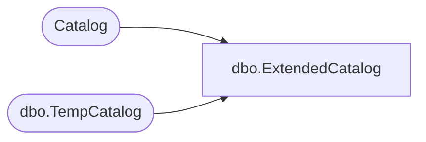

# dbo.ExtendedCatalog

**Database:** ReportServerWebIM  
**Server:** bedrockdb01  
**Function Type:** Inline Table-Valued Function  

## Architecture Diagram



## Parameters

| Parameter | Data Type | Max Length | Is Output |
|---|---|---|---|
| @OwnerID | uniqueidentifier | 16 | NO |
| @Path | nvarchar | 850 | NO |
| @EditSessionID | varchar | 32 | NO |

## Table Dependencies

| Referenced Table |
|---|
| Catalog |
| dbo.TempCatalog |

## Function Code

```sql
CREATE FUNCTION [dbo].[ExtendedCatalog]
    (@OwnerID as uniqueidentifier, 
     @Path as nvarchar(425), 
     @EditSessionID as varchar(32))
RETURNS TABLE 
AS RETURN 
(
SELECT TOP 1 * FROM (
SELECT 
    C.[ItemID], 
    C.[PolicyID],
    C.[Path],
    C.[Name],
    C.[Description], 
    C.[Property],
    C.[Type], 
    C.[ExecutionFlag], 
    C.[Parameter], 
    C.[Intermediate], 
    CONVERT(BIT, 1) AS IntermediateIsPermanent, 
    C.[SnapshotDataID], 
    C.[LinkSourceID], 
    C.[ExecutionTime], 
    C.[SnapshotLimit],
    C.[CreatedByID], 
    C.[ModifiedByID],
    C.[CreationDate],
    C.[ModifiedDate], 
    C.[MimeType],
    C.[Content],
    C.[Hidden],
    NULL AS [EditSessionID], 
    C.[SubType],
    C.[ComponentID]
FROM [Catalog] C
WHERE C.Path = @Path AND @EditSessionID IS NULL
UNION ALL
SELECT 
    TC.[TempCatalogID], 
    NULL as [PolicyID],
    TC.[ContextPath],
    TC.[Name],
    TC.[Description], 
    TC.[Property],
    2 as [Type], 
    1 as [ExecutionFlag],
    TC.[Parameter], 
    TC.[Intermediate], 
    TC.[IntermediateIsPermanent],
    NULL as [SnapshotDataID], 
    NULL as [LinkSourceID], 
    NULL as [ExecutionTime], 
    0 as [SnapshotLimit],
    TC.[OwnerID] as [CreatedByID],
    TC.[OwnerID] as [ModifiedByID],
    TC.[CreationTime] as [CreationDate],
    TC.[CreationTime] as [ModifiedDate],
    NULL as [MimeType],
    TC.Content,
    convert(bit, 0) as [Hidden],
    TC.[EditSessionID] AS [EditSessionID], 
    NULL as [SubType],
    NULL as [ComponentID]
FROM [ReportServerWebIMTempDB].dbo.TempCatalog TC
WHERE	TC.OwnerID = @OwnerID AND
        TC.ContextPath = @Path AND
        TC.EditSessionID = @EditSessionID
) A )
```

