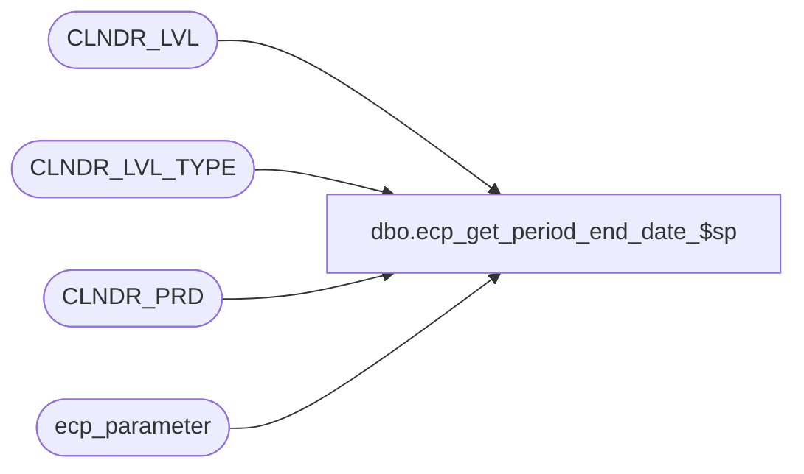

# dbo.ecp_get_period_end_date_$sp

**Database:** auditworks  
**Server:** bedrockdb01  
**Function Type:** Scalar Function  
**Returns:** varchar(10)  

## Architecture Diagram



## Parameters

| Parameter | Data Type | Max Length | Is Output |
|---|---|---|---|
| @date | datetime | 8 | NO |

## Table Dependencies

| Referenced Table |
|---|
| CLNDR_LVL |
| CLNDR_LVL_TYPE |
| CLNDR_PRD |
| ecp_parameter |

## Function Code

```sql
CREATE FUNCTION dbo.ecp_get_period_end_date_$sp (@date datetime)
RETURNS varchar(10)
AS
BEGIN
DECLARE
  @ecp_clndr_id			binary(16),
  @lowest_calendar_level_id	binary(16)

SELECT @ecp_clndr_id = par_bin_value
  FROM ecp_parameter p
 WHERE par_name = 'ecp_dflt_clndr_id'  

SELECT @lowest_calendar_level_id = CLNDR_LVL_TYPE_ID
  FROM CLNDR_LVL_TYPE
 WHERE CLNDR_LVL_SEQ = (SELECT MAX(CLNDR_LVL_SEQ)
			  FROM CLNDR_LVL_TYPE
			 WHERE CLNDR_LVL_TYPE_ID
			    IN (SELECT DISTINCT CLNDR_LVL_TYPE_ID
                                  FROM CLNDR_LVL
                                  WHERE CLNDR_ID = @ecp_clndr_id))
   AND CLNDR_LVL_TYPE_ID
    IN (SELECT DISTINCT CLNDR_LVL_TYPE_ID
          FROM CLNDR_LVL
         WHERE CLNDR_ID = @ecp_clndr_id)

SELECT @date = dateadd(ss, -1, min(cp.END_DATE_TIME))
  FROM CLNDR_PRD cp
 WHERE cp.END_DATE_TIME > @date
   AND @ecp_clndr_id = cp.CLNDR_ID
   AND @lowest_calendar_level_id = cp.CLNDR_LVL_TYPE_ID


RETURN CONVERT(varchar(10), @date, 102)

END
```

