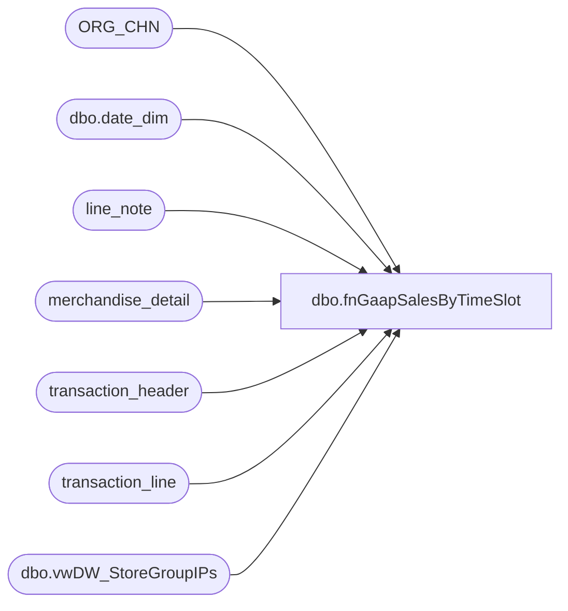

# dbo.fnGaapSalesByTimeSlot

**Database:** auditworks  
**Server:** bedrockdb01  
**Function Type:** Inline Table-Valued Function  

## Architecture Diagram



## Parameters

| Parameter | Data Type | Max Length | Is Output |
|---|---|---|---|
| @StartDate | date | 3 | NO |
| @EndDate | date | 3 | NO |

## Table Dependencies

| Referenced Table |
|---|
| ORG_CHN |
| dbo.date_dim |
| line_note |
| merchandise_detail |
| transaction_header |
| transaction_line |
| dbo.vwDW_StoreGroupIPs |

## Function Code

```sql
CREATE function [dbo].[fnGaapSalesByTimeSlot]
	(
	   @StartDate date,
       @EndDate date
	) 
returns table 
	--(
	--	StoreNo int,
	--	TransactionDate date,
	--	Slot varchar(5),
	--	NetSales decimal(38,2),
	--	TransactionCount int,
	--	NetUnits int
	--)

as Return
(

with 
AllTime (Slot) as
	(
				select '00:00'	UNION	select '00:30'	UNION	select '01:00'	UNION	select '01:30'	UNION	select '02:00'	UNION	select '02:30'	UNION	select '03:00'	UNION	select '03:30'
		UNION	select '04:00'	UNION	select '04:30'	UNION	select '05:00'	UNION	select '05:30'	UNION	select '06:00'	UNION	select '06:30'	UNION	select '07:00'	UNION	select '07:30'
		UNION	select '08:00'	UNION	select '08:30'	UNION	select '09:00'	UNION	select '09:30'	UNION	select '10:00'	UNION	select '10:30'	UNION	select '11:00'	UNION	select '11:30'
		UNION	select '12:00'	UNION	select '12:30'	UNION	select '13:00'	UNION	select '13:30'	UNION	select '14:00'	UNION	select '14:30'	UNION	select '15:00'  UNION	select '15:30'
		UNION	select '16:00'	UNION	select '16:30'	UNION	select '17:00'	UNION	select '17:30'	UNION	select '18:00'	UNION	select '18:30'	UNION	select '19:00'	UNION	select '19:30'
		UNION	select '20:00'	UNION	select '20:30'	UNION	select '21:00'	UNION	select '21:30'	UNION	select '22:00'	UNION	select '22:30'	UNION	select '23:00'	UNION	select '23:30'
	),
DateTimes as
	(
		select distinct
			cast(dd.actual_date as date) as RawDate,
			convert(varchar, dd.actual_date, 103) as Date,
			alt.Slot
		from PAPAMART.dw.dbo.date_dim dd with (nolock) 
		cross join AllTime alt
		where cast(dd.actual_date as date) between @StartDate and @EndDate
	),
StoreDateTime as
	(
		select 
			dt.RawDate,
			dt.Date,
			sl.LocationCode as StoreCode,
			dt.Slot,
			sl.StoreID as StoreCodeRaw
		from KODIAK.babwmstrdata.dbo.vwDW_StoreGroupIPs sl
		cross join DateTimes dt
		--where sl.StoreID not in (13,2013)
	),
Gaap as 
	(
		SELECT  
			h.transaction_id,
			cast(substring (ln.line_note, 12,30) as varchar(10)) as WebOrderNumber,
			h.store_no AS StoreNo,
			cast(h.entry_date_time as date) as TransactionDate,
			datepart(hh, h.entry_date_time) as TransactionHour,
			right((cast('00' as varchar) + cast(datepart(hh, h.entry_date_time) as varchar)),2)
				+ ':' + case when datepart(mi, h.entry_date_time) < 30 then '00' else '30' end as Slot,
			( SUM(( (l.gross_line_amount - l.pos_discount_amount) )
				* l.db_cr_none * l.voiding_reversal_flag) ) * -1
			AS NetSales,
			count(distinct h.transaction_id) TransactionCount,
			cast(OC.DFLT_CRNCY_CODE AS CHAR(3)) AS CurrencyCode,
			sum(cast(md.units as int)) as NetUnits
		FROM    
			transaction_header h with (nolock)
			JOIN transaction_line l with (nolock) ON h.transaction_id = l.transaction_id
			left JOIN ORG_CHN OC WITH (NOLOCK) ON h.store_no = OC.ORG_CHN_NUM
			join merchandise_detail md with (nolock) 
				on h.transaction_id = md.transaction_id 
				and l.line_id=md.line_id
			join line_note ln (nolock) 
				on h.transaction_id = ln.transaction_id
				and ln.line_note like 'Web Order%'
		WHERE   
			( 
				h.transaction_void_flag = 0
				AND l.line_void_flag = 0 
			)
			AND 
			(
				(h.transaction_category IN (1, 2) AND l.line_object_type <> 12 and h.transaction_series <> 'C' and l.line_action <> 95) --exc
					OR 
				(h.transaction_category IN (10) AND (l.line_object_type = 7 OR l.line_object BETWEEN 700 AND 799) and h.transaction_series <> 'C')
					OR
				(h.transaction_category = 242 and 
						(
							(l.line_object = 106 and l.line_action in (90,99,142)) --es fulfillments
								or
							(l.line_object in (200, 203) and line_action = 97) --es shipping on fulfillment
							
						)
							and h.transaction_series = 'C')  --es fulfillments, returns (technically this is customer liability, which is how es fulfillments post
			)
				
				AND NOT (h.store_no = 13 AND h.register_no = 3 AND h.transaction_date <= '1/31/2012')
				AND 
					(
						l.line_object IN (100, 102, 103, 104, 200, 202, 203, 204, 206, 210, 250, 290, 291, 293, 295, 296, 623, 640, 690, 691, 1630, 1631, 1199, 115, 215, 1660) 
					)
			and store_no not in (13,2013)
			and cast(h.entry_date_time as date) between @StartDate and @EndDate
		GROUP BY 
			h.transaction_id,
			cast(substring (ln.line_note, 12,30) as varchar(10)),
			h.store_no, 
			cast(h.entry_date_time as date),
			datepart(hh, h.entry_date_time),
			right((cast('00' as varchar) + cast(datepart(hh, h.entry_date_time) as varchar)),2)
			+ ':' + case when datepart(mi, h.entry_date_time) < 30 then '00' else '30' end,
			cast(OC.DFLT_CRNCY_CODE AS CHAR(3))
		--UNION
		--SELECT  
		--	h.av_transaction_id,
		--	cast(substring (ln.line_note, 12,30) as varchar(10)) as WebOrderNumber,
		--	h.store_no AS StoreNo,
		--	cast(h.entry_date_time as date) as TransactionDate,
		--	datepart(hh, h.entry_date_time) as TransactionHour,
		--	right((cast('00' as varchar) + cast(datepart(hh, h.entry_date_time) as varchar)),2)
		--		+ ':' + case when datepart(mi, h.entry_date_time) < 30 then '00' else '30' end as Slot,
		--	( SUM(( (l.gross_line_amount - l.pos_discount_amount) )
		--		* l.db_cr_none * l.voiding_reversal_flag) ) * -1
		--	AS NetSales,
		--	count(distinct h.av_transaction_id) TransactionCount,
		--	cast(OC.DFLT_CRNCY_CODE AS CHAR(3)) AS CurrencyCode,
		--	sum(cast(md.units as int)) as NetUnits
		--FROM    
		--	av_transaction_header h with (nolock)
		--	JOIN av_transaction_line l with (nolock) ON h.av_transaction_id = l.av_transaction_id
		--	left JOIN ORG_CHN OC WITH (NOLOCK) ON h.store_no = OC.ORG_CHN_NUM
		--	join av_merchandise_detail md with (nolock) 
		--		on h.av_transaction_id = md.av_transaction_id 
		--		and l.line_id=md.line_id
		--	join av_line_note ln (nolock) 
		--		on h.av_transaction_id = ln.av_transaction_id
		--		and ln.line_note like 'Web Order%'
		--WHERE   
		--	( 
		--		h.transaction_void_flag = 0
		--		AND l.line_void_flag = 0 
		--	)
		--	AND 
		--	(
		--		(h.transaction_category IN (1, 2) AND l.line_object_type <> 12 and h.transaction_series <> 'C' and l.line_action <> 95) --exc
		--			OR 
		--		(h.transaction_category IN (10) AND (l.line_object_type = 7 OR l.line_object BETWEEN 700 AND 799) and h.transaction_series <> 'C')
		--			OR
		--		(h.transaction_category = 242 and 
		--				(
		--					(l.line_object = 106 and l.line_action in (90,99,142)) --es fulfillments
		--						or
		--					(l.line_object in (200, 203) and line_action = 97) --es shipping on fulfillment
							
		--				)
		--					and h.transaction_series = 'C')  --es fulfillments, returns (technically this is customer liability, which is how es fulfillments post
		--	)
				
		--		AND NOT (h.store_no = 13 AND h.register_no = 3 AND h.transaction_date <= '1/31/2012')
		--		AND 
		--			(
		--				l.line_object IN (100, 102, 103, 104, 200, 202, 203, 204, 206, 210, 250, 290, 291, 293, 295, 296, 623, 640, 690, 691, 1630, 1631, 1199, 115, 215, 1660) 
		--			)
		--	and store_no not in (13,2013)
		--	and cast(h.entry_date_time as date) between @StartDate and @EndDate
		--GROUP BY 
		--	h.av_transaction_id,
		--	cast(substring (ln.line_note, 12,30) as varchar(10)),
		--	h.store_no, 
		--	cast(h.entry_date_time as date),
		--	datepart(hh, h.entry_date_time),
		--	right((cast('00' as varchar) + cast(datepart(hh, h.entry_date_time) as varchar)),2)
		--	+ ':' + case when datepart(mi, h.entry_date_time) < 30 then '00' else '30' end,
		--	cast(OC.DFLT_CRNCY_CODE AS CHAR(3))
	),
Summary as
	(
		select
			d.transaction_id as TransactionID,
			d.WebOrderNumber,
			sdt.StoreCode as StoreNo,
			sdt.StoreCodeRaw,
			sdt.Date,
			sdt.RawDate as TransactionDateRaw,
			sdt.Slot,
				cast(CASE
					WHEN CAST(d.StoreNo AS INT) between 3000 and 3999 --China
						THEN d.NetSales / 1.1700

					WHEN CAST(d.StoreNo as INT) IN (2036, 2054) -- Ireland
						THEN d.NetSales / 1.2100

					WHEN CAST(d.StoreNo as INT) = 2301 --Denmark
						THEN d.NetSales / 1.2500

					WHEN CAST(d.StoreNo AS INT) >= 2000 and CAST(d.StoreNo AS INT) <> 2013  -- UK
						THEN d.NetSales / 1.175

					ELSE d.NetSales --All Others
						END as decimal(38,2)) 
					AS NetSales,
			d.TransactionCount,
			d.NetUnits,
			d.CurrencyCode
		from StoreDateTime sdt
		left join Gaap d 
			on sdt.StoreCodeRaw=d.StoreNo
			and sdt.RawDate=d.TransactionDate
			and sdt.Slot=d.Slot
		where sdt.RawDate between @StartDate and @EndDate --< cast(getdate() as date)
	)
select
	TransactionID,
	WebOrderNumber,
	StoreNo,
	StoreNo as StoreCode,
	StoreCodeRaw,
	Date,
	TransactionDateRaw,
	Slot,
	sum(isnull(NetSales,0)) NetSales,
	sum(isnull(TransactionCount,0)) TransactionCount,
	sum(isnull(NetUnits,0)) as NetUnits
from Summary
group by
	TransactionID,
	WebOrderNumber,
	StoreNo,
	StoreCodeRaw,
	Date,
	TransactionDateRaw,
	Slot

)
```

