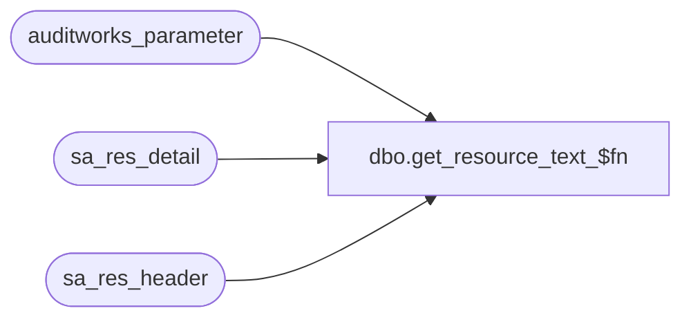

# dbo.get_resource_text_$fn

**Database:** auditworks  
**Server:** bedrockdb01  
**Function Type:** Scalar Function  
**Returns:** nvarchar(4000)  

## Architecture Diagram



## Parameters

| Parameter | Data Type | Max Length | Is Output |
|---|---|---|---|
| @resource_name | nvarchar | 1024 | NO |
| @language_id | int | 4 | NO |

## Table Dependencies

| Referenced Table |
|---|
| auditworks_parameter |
| sa_res_detail |
| sa_res_header |

## Function Code

```sql
CREATE FUNCTION dbo.get_resource_text_$fn ( @resource_name                   nvarchar(512),
  @language_id                     int )

returns nvarchar(2000)

AS

BEGIN

DECLARE
@base_language_id                int,
@default_base_language_id        int,
@errno                           int,
@errmsg                          nvarchar(2000),
@message_id                      int,
@object_name                     nvarchar(255),
@operation_name                  nvarchar(100),
@process_no                      smallint,
@raise_error                     int,
@resource_value                  nvarchar(2000)  -- use nvarchar to support internationalization in the future


/*

Proc name: get_resource_text_$fn
     Desc: get resource text based on a particular resource name and language id.
           To provide similiar functionality as the C# method AssemblyHelper.Resources.GetText().
           Does not return image.
           Called by rprt_* stored proc.

HISTORY
Date     Name                 Defect Desc
Jan06,11 Paul                 105313 Use unicode datatypes
Sep17,10 Phu                  120978 Default to the base language setup in the parameter if the desired language is not supported.
Jul21,09 Phu                1-3ZZR15 Initial development

*/

SELECT @process_no = 300,  -- report
   @message_id = 201068,
   @default_base_language_id = 1033 -- English

SELECT @resource_value = d.resource_value
FROM sa_res_header h INNER JOIN sa_res_detail d ON (h.resource_id = d.resource_id)
WHERE h.resource_name = @resource_name
AND d.culture_lcid = @language_id

SELECT @errno = @@error
IF @errno <> 0
BEGIN
   SELECT @errmsg = 'Unable to select resource_value for the requested language id',
          @object_name = 'sa_res_detail',
          @operation_name = 'SELECT'
   GOTO error
END

IF @resource_value IS NULL -- (1)
BEGIN

   SELECT @base_language_id = CONVERT(INT, par_value)
   FROM auditworks_parameter
   WHERE par_name = 'base_language_id'

   SELECT @errno = @@error
   IF @errno <> 0
   BEGIN
      SELECT @errmsg = 'Unable to select value for par_name = base_language_id',
             @object_name = 'auditworks_parameter',
             @operation_name = 'SELECT'
      GOTO error
   END

   SELECT @resource_value = d.resource_value
   FROM sa_res_header h INNER JOIN sa_res_detail d ON (h.resource_id = d.resource_id)
   WHERE h.resource_name = @resource_name
   AND d.culture_lcid = @base_language_id

   SELECT @errno = @@error
   IF @errno <> 0
   BEGIN
      SELECT @errmsg = 'Unable to select resource_value for base language id',
             @object_name = 'sa_res_detail',
             @operation_name = 'SELECT'
      GOTO error
   END

   IF @resource_value IS NULL -- (2)
   BEGIN
      IF @base_language_id <> @default_base_language_id
      BEGIN
         SELECT @resource_value = COALESCE(d.resource_value, @resource_name)
         FROM sa_res_header h INNER JOIN sa_res_detail d ON (h.resource_id = d.resource_id)
         WHERE h.resource_name = @resource_name
         AND d.culture_lcid = @default_base_language_id

         SELECT @errno = @@error
         IF @errno <> 0
         BEGIN
            SELECT @errmsg = 'Unable to select resource_value for default base language id 1033',
                   @object_name = 'sa_res_detail',
                   @operation_name = 'SELECT'
            GOTO error
         END
      END
      ELSE
         SELECT @resource_value = @resource_name
   END -- IF @resource_value IS NULL -- (2)
END -- IF @resource_value IS NULL -- (1)


RETURN @resource_value


error:

/*  Can't raise error inside a function
    SELECT @errmsg = 'get_resource_text_$fn ' + convert(nvarchar, @errno) + '-' + @errmsg + 'process_no  ' + @process_no + 'object_name ' + @object_name + 'operation_name ' + @operation_name;

    SELECT @raise_error = @errno
    IF @raise_error < 100000
       SELECT @raise_error = @errno + 100000

    RAISERROR @raise_error @errmsg
*/
  
    RETURN @resource_name

END
```

