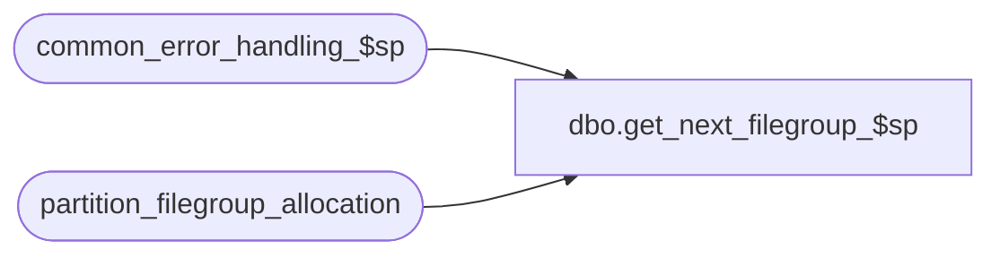

# dbo.get_next_filegroup_$sp

**Database:** auditworks_external  
**Server:** bedrockdb01  
**Function Type:** Scalar Function  
**Returns:** sysname(256)  

## Architecture Diagram



## Parameters

| Parameter | Data Type | Max Length | Is Output |
|---|---|---|---|
| @current_filegroup | sysname | 256 | NO |

## Table Dependencies

| Referenced Table |
|---|
| common_error_handling_$sp |
| partition_filegroup_allocation |

## Function Code

```sql
CREATE FUNCTION [dbo].[get_next_filegroup_$sp] 
(@current_filegroup                    sysname)

RETURNS sysname
AS

/*

Proc name: get_next_filegroup_$sp
     Desc: To retrieve the next available filegroup after the @current_filegroup.
           Called by util_partition_archive_tb_$sp and partition_maintenance_$sp.

HISTORY:
Date     Name            Defect# Description
Aug19,08 Phu               95126 Initial development

*/


BEGIN

DECLARE
  @current_loop                         tinyint,
  @errmsg                               nvarchar(255),
  @errno                                int,
  @filegroup_allocated                  sysname,
  @filegroup_sequence                   int,
  @max_loop                             tinyint,
  @message_id                           int,
  @next_filegroup                       sysname,
  @object_name                          nvarchar(255),
  @operation_name                       nvarchar(100),
  @process_name                         nvarchar(100),
  @process_no                           smallint,
  @rows                                 int,
  @temp_filegroup                       sysname,
  @user_id                              int


SELECT @message_id = 201068,
       @process_name = 'get_next_filegroup_$sp',
       @user_id = SUSER_ID(SUSER_SNAME()),
       @process_no = 18,
       @max_loop = 2, -- should find result after 2 loops
       @current_loop = 0

SELECT @rows = COUNT(1)
FROM partition_filegroup_allocation
WHERE table_group = 'archive'

SELECT @errno = @@error
IF @errno != 0
BEGIN
  SELECT @errmsg = 'Unable to retrieve count',
         @object_name = 'partition_filegroup_allocation',
         @operation_name = 'SELECT'
   GOTO error
END

IF @rows = 0
  RETURN NULL

SELECT @filegroup_allocated = @current_filegroup

WHILE @current_loop < @max_loop
BEGIN
  SELECT @current_loop = @current_loop + 1
  IF @filegroup_allocated IS NULL
  BEGIN
    SELECT @filegroup_sequence = MIN(filegroup_sequence) - 1
    FROM partition_filegroup_allocation
    WHERE table_group = 'archive'
  END
  ELSE
  BEGIN
    SELECT @filegroup_sequence = MIN(filegroup_sequence)
    FROM partition_filegroup_allocation
    WHERE table_group = 'archive'
    AND filegroup_allocated = @filegroup_allocated
  END

  SELECT @temp_filegroup = NULL
  SELECT @temp_filegroup = filegroup_allocated
  FROM partition_filegroup_allocation
  WHERE table_group = 'archive'
  AND filegroup_sequence IN (SELECT MIN(filegroup_sequence)
                             FROM partition_filegroup_allocation
                             WHERE table_group = 'archive'
                             AND filegroup_sequence > @filegroup_sequence)

  IF @temp_filegroup IS NOT NULL
  BEGIN
    SELECT @next_filegroup = @temp_filegroup
    BREAK
  END
  ELSE
    SELECT @filegroup_allocated = NULL

END -- while @current_loop < @max_loop

RETURN @next_filegroup

error:

	EXEC common_error_handling_$sp @process_no, @errno, @errmsg, 0, @message_id, 
	@process_name, @object_name, @operation_name, 0, 1, 0, null, 0, null, null,
	null, null, null, null, 0, NULL, @user_id
	RETURN NULL

END
```

