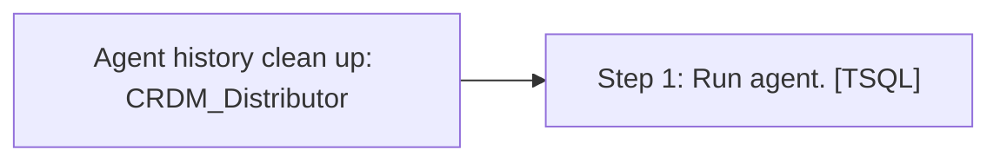

# Job: Agent history clean up: CRDM_Distributor

**Enabled:** Yes  
**Server:** bedrockdb01  
**Description:** Removes replication agent history from the distribution database.  

## Architecture Diagram



## Steps

### Step 1: Run agent.
**Subsystem:** TSQL  

```sql
EXEC dbo.sp_MShistory_cleanup @history_retention = 48
```

