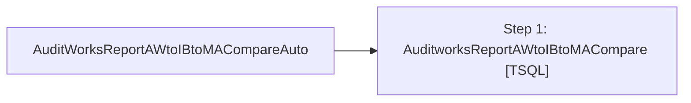

# Job: AuditWorksReportAWtoIBtoMACompareAuto

**Enabled:** Yes  
**Server:** bedrockdb01  
**Description:** No description available.  

## Architecture Diagram



## Steps

### Step 1: AuditworksReportAWtoIBtoMACompare
**Subsystem:** TSQL  

```sql
EXEC [auditworks].[dbo].[spAuditworksReportAWtoIBtoMACompareUpdateV2]
```

