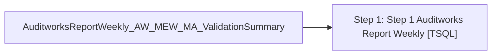

# Job: AuditworksReportWeekly_AW_MEW_MA_ValidationSummary

**Enabled:** Yes  
**Server:** bedrockdb01  
**Description:** Executes spAuditworksReportWeekly_AW_MEW_MA_ValidationSummary Every Sunday @ 8am  

## Architecture Diagram



## Steps

### Step 1: Step 1 Auditworks Report Weekly
**Subsystem:** TSQL  

```sql
exec [auditworks].[dbo].[spAuditworksReportWeekly_AW_MEW_MA_ValidationSummary]
```

