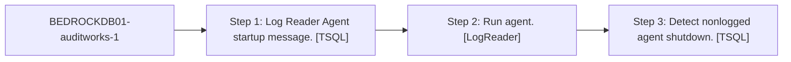

# Job: BEDROCKDB01-auditworks-1

**Enabled:** Yes  
**Server:** bedrockdb01  
**Description:** No description available.  

## Architecture Diagram



## Steps

### Step 1: Log Reader Agent startup message.
**Subsystem:** TSQL  

```sql
sp_MSadd_logreader_history @perfmon_increment = 0, @agent_id = 1, @runstatus = 1, 
                    @comments = N'Starting agent.'
```

### Step 2: Run agent.
**Subsystem:** LogReader  

```sql
-Publisher [BEDROCKDB01] -PublisherDB [auditworks] -Distributor [BEDROCKDB01] -DistributorSecurityMode 1  -Continuous
```

### Step 3: Detect nonlogged agent shutdown.
**Subsystem:** TSQL  

```sql
sp_MSdetect_nonlogged_shutdown @subsystem = 'LogReader', @agent_id = 1
```

