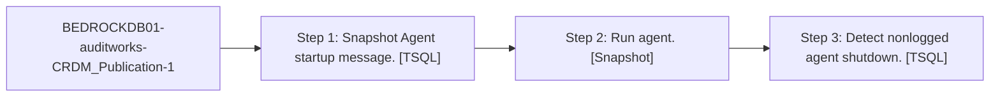

# Job: BEDROCKDB01-auditworks-CRDM_Publication-1

**Enabled:** Yes  
**Server:** bedrockdb01  
**Description:** No description available.  

## Architecture Diagram



## Steps

### Step 1: Snapshot Agent startup message.
**Subsystem:** TSQL  

```sql
sp_MSadd_snapshot_history @perfmon_increment = 0,  @agent_id = 1, @runstatus = 1,  
                    @comments = N'Starting agent.'
```

### Step 2: Run agent.
**Subsystem:** Snapshot  

```sql
-Publisher [BEDROCKDB01] -PublisherDB [auditworks] -Distributor [BEDROCKDB01] -Publication [CRDM_Publication] -DistributorSecurityMode 1
```

### Step 3: Detect nonlogged agent shutdown.
**Subsystem:** TSQL  

```sql
sp_MSdetect_nonlogged_shutdown @subsystem = 'Snapshot', @agent_id = 1
```

