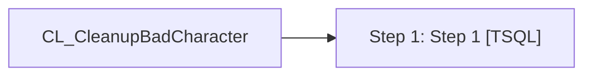

# Job: CL_CleanupBadCharacter

**Enabled:** Yes  
**Server:** bedrockdb01  
**Description:** exec spCL_CleanupBadCharacters  

## Architecture Diagram



## Steps

### Step 1: Step 1
**Subsystem:** TSQL  

```sql
exec spCL_CleanupBadCharacters
```

