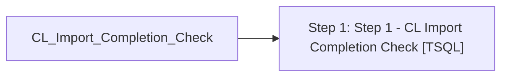

# Job: CL_Import_Completion_Check

**Enabled:** Yes  
**Server:** bedrockdb01  
**Description:** Checks CL import status for completion and notifies via email accordingly  

## Architecture Diagram



## Steps

### Step 1: Step 1 - CL Import Completion Check
**Subsystem:** TSQL  

```sql
exec spCL_Import_Completion_Check
```

