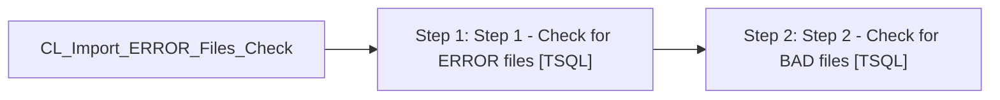

# Job: CL_Import_ERROR_Files_Check

**Enabled:** Yes  
**Server:** bedrockdb01  
**Description:** 1) Checks for .ERROR files and reports to Direct Marketing team that these need to be investigated, corrected and resubmitted 2) Checks for .BAD and reports to POSadmin that these need to be investigated, corrected and resubmitted  

## Architecture Diagram



## Steps

### Step 1: Step 1 - Check for ERROR files
**Subsystem:** TSQL  

```sql
exec spCL_Import_ERROR_Files_Check
```

### Step 2: Step 2 - Check for BAD files
**Subsystem:** TSQL  

```sql
exec spCL_Import_BAD_Files_Check
```

