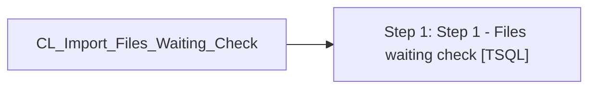

# Job: CL_Import_Files_Waiting_Check

**Enabled:** Yes  
**Server:** bedrockdb01  
**Description:** Check the \\saapp01\CL_IMPORT\Voucher_Import folder for .tab files and validates and reports accordingly  

## Architecture Diagram



## Steps

### Step 1: Step 1 - Files waiting check
**Subsystem:** TSQL  

```sql
exec spCL_Import_Files_Waiting_Check
```

