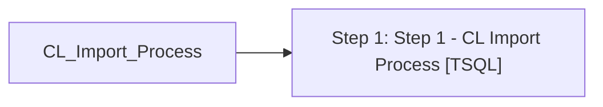

# Job: CL_Import_Process

**Enabled:** Yes  
**Server:** bedrockdb01  
**Description:** Checks for files and starts CL import validation and import process & notifies via email accordingly  

## Architecture Diagram



## Steps

### Step 1: Step 1 - CL Import Process
**Subsystem:** TSQL  

```sql
exec spCL_Import_Process
```

