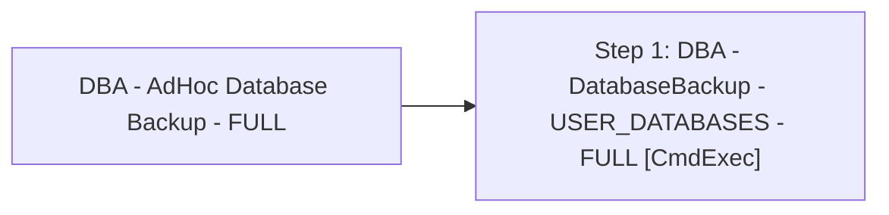

# Job: DBA - AdHoc Database Backup - FULL

**Enabled:** Yes  
**Server:** bedrockdb01  
**Description:** Source: https://ola.hallengren.com  

## Architecture Diagram



## Steps

### Step 1: DBA - DatabaseBackup - USER_DATABASES - FULL
**Subsystem:** CmdExec  

```sql
sqlcmd -E -S $(ESCAPE_SQUOTE(SRVR)) -d master -Q "EXECUTE [dbo].[DatabaseBackup] @Databases = 'auditworks,auditworks_work,foundation,foundation_event', @Directory = N'\\stl-esxbak-p-34\sqlbackups\AptosLive2Test', @BackupType = 'FULL', @Verify = 'Y', @CleanupTime = 336, @CheckSum = 'Y', @LogToTable = 'Y'" -b
```

