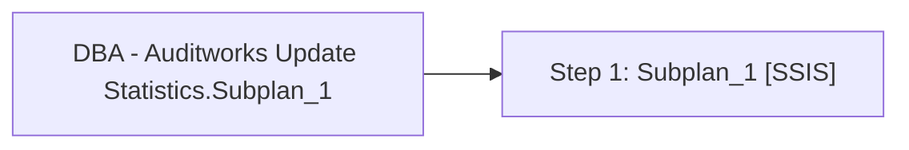

# Job: DBA - Auditworks Update Statistics.Subplan_1

**Enabled:** No  
**Server:** bedrockdb01  
**Description:** No description available.  

## Architecture Diagram



## Steps

### Step 1: Subplan_1
**Subsystem:** SSIS  

```sql
/Server "$(ESCAPE_NONE(SRVR))" /SQL "Maintenance Plans\DBA - Auditworks Update Statistics" /set "\Package\Subplan_1.Disable;false"
```

