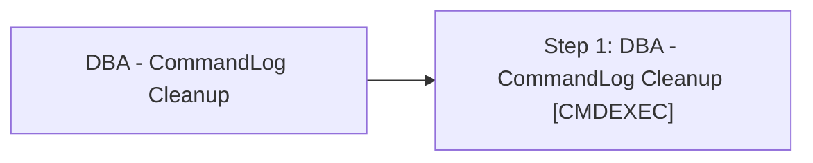

# Job: DBA - CommandLog Cleanup

**Enabled:** Yes  
**Server:** bedrockdb01  
**Description:** Source: https://ola.hallengren.com  

## Architecture Diagram



## Steps

### Step 1: DBA - CommandLog Cleanup
**Subsystem:** CMDEXEC  

```sql
sqlcmd -E -S $(ESCAPE_SQUOTE(SRVR)) -d master -Q "DELETE FROM [dbo].[CommandLog] WHERE StartTime < DATEADD(dd,-30,GETDATE())" -b
```

