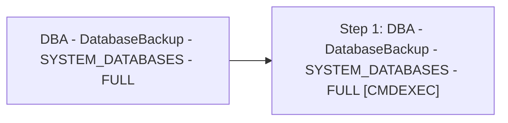

# Job: DBA - DatabaseBackup - SYSTEM_DATABASES - FULL

**Enabled:** Yes  
**Server:** bedrockdb01  
**Description:** Source: https://ola.hallengren.com  

## Architecture Diagram



## Steps

### Step 1: DBA - DatabaseBackup - SYSTEM_DATABASES - FULL
**Subsystem:** CMDEXEC  

```sql
sqlcmd -E -S $(ESCAPE_SQUOTE(SRVR)) -d master -Q "EXECUTE [dbo].[DatabaseBackup] @Databases = 'SYSTEM_DATABASES', @Directory = N'\\stl-esxbak-p-32\sqlbackups\', @BackupType = 'FULL', @Verify = 'Y', @CleanupTime = 72, @CheckSum = 'Y', @LogToTable = 'Y'" -b
```

