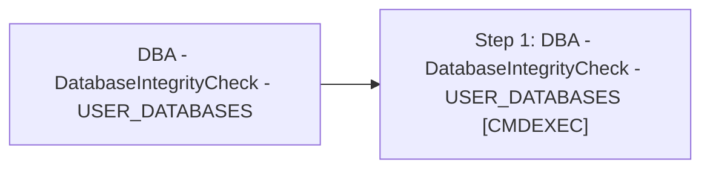

# Job: DBA - DatabaseIntegrityCheck - USER_DATABASES

**Enabled:** Yes  
**Server:** bedrockdb01  
**Description:** Source: https://ola.hallengren.com  

## Architecture Diagram



## Steps

### Step 1: DBA - DatabaseIntegrityCheck - USER_DATABASES
**Subsystem:** CMDEXEC  

```sql
sqlcmd -E -S $(ESCAPE_SQUOTE(SRVR)) -d master -Q "EXECUTE [dbo].[DatabaseIntegrityCheck] @Databases = 'USER_DATABASES', @LogToTable = 'Y'" -b
```

