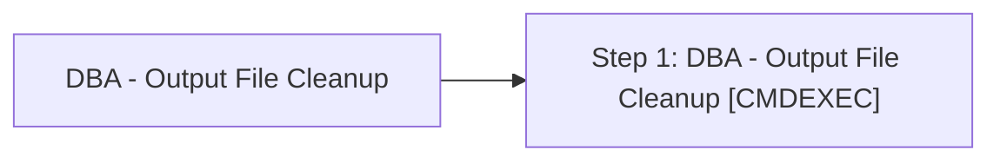

# Job: DBA - Output File Cleanup

**Enabled:** Yes  
**Server:** bedrockdb01  
**Description:** Source: https://ola.hallengren.com  

## Architecture Diagram



## Steps

### Step 1: DBA - Output File Cleanup
**Subsystem:** CMDEXEC  

```sql
cmd /q /c "For /F "tokens=1 delims=" %v In ('ForFiles /P "D:\MSSQL11.MSSQLSERVER\MSSQL\LOG" /m *_*_*_*.txt /d -30 2^>^&1') do if EXIST "D:\MSSQL11.MSSQLSERVER\MSSQL\LOG"\%v echo del "D:\MSSQL11.MSSQLSERVER\MSSQL\LOG"\%v& del "D:\MSSQL11.MSSQLSERVER\MSSQL\LOG"\%v"
```

