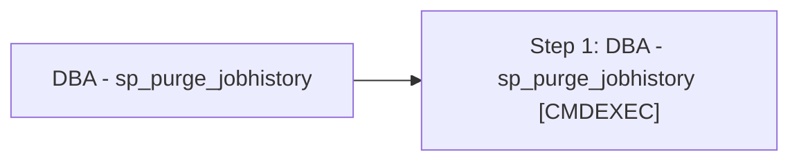

# Job: DBA - sp_purge_jobhistory

**Enabled:** Yes  
**Server:** bedrockdb01  
**Description:** Source: https://ola.hallengren.com  

## Architecture Diagram



## Steps

### Step 1: DBA - sp_purge_jobhistory
**Subsystem:** CMDEXEC  

```sql
sqlcmd -E -S $(ESCAPE_SQUOTE(SRVR)) -d msdb -Q "DECLARE @CleanupDate datetime SET @CleanupDate = DATEADD(dd,-30,GETDATE()) EXECUTE dbo.sp_purge_jobhistory @oldest_date = @CleanupDate" -b
```

