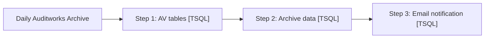

# Job: Daily Auditworks Archive

**Enabled:** No  
**Server:** bedrockdb01  
**Description:** 20120213 - mikep - archive caught up. modified schedule to fire once a day @ 10pm 20120208 - mikep - stored procedure changed to keep all archive activities in one database. schedule modified to catch up audit records from 10/31/2010 on.  

## Architecture Diagram



## Steps

### Step 1: AV tables
**Subsystem:** TSQL  

```sql
EXEC dbo.spAuditworks_Archive_AV_Tables null
```

### Step 2: Archive data
**Subsystem:** TSQL  

```sql
exec dbo.spAuditworks_Archive_Master
```

### Step 3: Email notification
**Subsystem:** TSQL  

```sql
exec PAPAMART_MAINT.DBAUtility.dbo.spDBA_SendEmail @recipients = 'Databears@buildabear.com', 
		@subject = ' Job failure of Daily Auditworks Archive on posdbssa', @MessageTxt = 'The SQL  job Daily Auditworks Archive posdbssa had an error.  Check the job history for more information'
```

