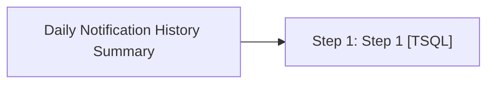

# Job: Daily Notification History Summary

**Enabled:** Yes  
**Server:** bedrockdb01  
**Description:** No description available.  

## Architecture Diagram



## Steps

### Step 1: Step 1
**Subsystem:** TSQL  

```sql
exec spDailyNotificationHistorySummary
```

