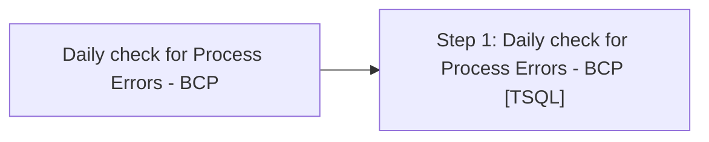

# Job: Daily check for Process Errors - BCP

**Enabled:** Yes  
**Server:** bedrockdb01  
**Description:** Check for BCP Process Errors  

## Architecture Diagram



## Steps

### Step 1: Daily check for Process Errors - BCP
**Subsystem:** TSQL  

```sql
exec spDailyCheckForProcessErrors @checkstep = 'BCP'
```

