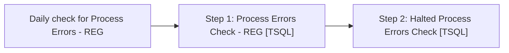

# Job: Daily check for Process Errors - REG

**Enabled:** Yes  
**Server:** bedrockdb01  
**Description:** Checks for Process Errors and Halted Processes  

## Architecture Diagram



## Steps

### Step 1: Process Errors Check - REG
**Subsystem:** TSQL  

```sql
exec spDailyCheckForProcessErrors @checkstep = 'REG'
```

### Step 2: Halted Process Errors Check
**Subsystem:** TSQL  

```sql
exec spDailyCheckForHaltedProcesses
```

