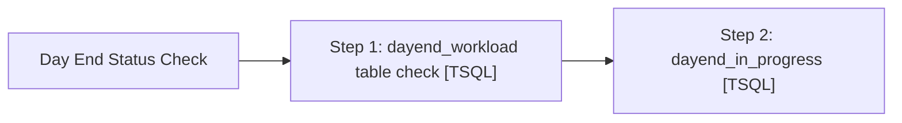

# Job: Day End Status Check

**Enabled:** Yes  
**Server:** bedrockdb01  
**Description:** No description available.  

## Architecture Diagram



## Steps

### Step 1: dayend_workload table check
**Subsystem:** TSQL  

```sql
declare @sql varchar(8000)
declare @recipients varchar(8000)
declare @Subject varchar(50)
declare @query varchar(8000)

set @Subject = 'ALERT - Day End in Sales Audit not complete'
set @recipients = 'EntSysSupport@buildabear.com'
--set @recipients = 'paulb@buildabear.com'

set @query = 
'
print ''The Day End process in Sales Audit may not have completed.''
print ''''
print ''The "dayend_workload" table in auditworks should be empty and is not.''
print ''This needs to be investigated and resolved if and issue exists''
print ''''
print ''Check the Smartload logs in \\saapp01\d$\EPICOR\auditworks\ICT_DAYEND01''
PRINT ''''
PRINT ''''
PRINT ''Server:  BEDROCKDB01''
PRINT ''Job Name:  Day End Status Check''
PRINT ''Created by:  Paul Beckman''
PRINT ''Team Ownership:  POSadmin''
'

if (select count(*) from dayend_workload) > 0
-- send the email if we have anything to report
begin
	exec msdb.dbo.sp_send_dbmail  
		@profile_name = 'EntSysSupport',
		@recipients = @recipients,
		@subject=@Subject, 
		@query= @query,
		@query_result_width = 250
end
```

### Step 2: dayend_in_progress
**Subsystem:** TSQL  

```sql
declare @sql varchar(8000)
declare @recipients varchar(8000)
declare @Subject varchar(50)
declare @query varchar(8000)

set @Subject = 'ALERT - Day End in Sales Audit not complete'
set @recipients = 'EntSysSupport@buildabear.com'
--set @recipients = 'paulb@buildabear.com'

set @query = 
'
print ''The Day End process in Sales Audit may not have completed.''
print ''''
print ''The "parameter_general" table in auditworks shows the "dayend_in_progress" is equal to 1.''
print ''This needs to be investigated and resolved if and issue exists''
print ''''
print ''Check the Smartload logs in \\saapp01\d$\EPICOR\auditworks\ICT_DAYEND01''
PRINT ''''
PRINT ''''
PRINT ''Server:  BEDROCKDB01''
PRINT ''Job Name:  Day End Status Check''
PRINT ''Created by:  Paul Beckman''
PRINT ''Team Ownership:  POSadmin''
'

if (select count(*) from parameter_general where dayend_in_progress = '1') > 0
-- send the email if we have anything to report
begin
	exec msdb.dbo.sp_send_dbmail  
		@profile_name = 'EntSysSupport',
		@recipients = @recipients,
		@subject=@Subject, 
		@query= @query,
		@query_result_width = 250
end
```

