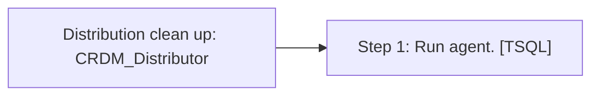

# Job: Distribution clean up: CRDM_Distributor

**Enabled:** Yes  
**Server:** bedrockdb01  
**Description:** Removes replicated transactions from the distribution database.  

## Architecture Diagram



## Steps

### Step 1: Run agent.
**Subsystem:** TSQL  

```sql
EXEC dbo.sp_MSdistribution_cleanup @min_distretention = 0, @max_distretention = 72
```

