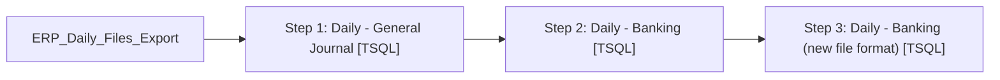

# Job: ERP_Daily_Files_Export

**Enabled:** Yes  
**Server:** bedrockdb01  
**Description:** Tender Totals Media rec export from SA for Dynamics 365 ERP  

## Architecture Diagram



## Steps

### Step 1: Daily - General Journal
**Subsystem:** TSQL  

```sql
exec spERP_Daily_Tender_Totals_Export
```

### Step 2: Daily - Banking
**Subsystem:** TSQL  

```sql
exec spERP_Daily_Banking_Totals_Export
```

### Step 3: Daily - Banking (new file format)
**Subsystem:** TSQL  

```sql
exec [dbo].[spERP_Daily_Banking_Totals_Export_v2]
```

