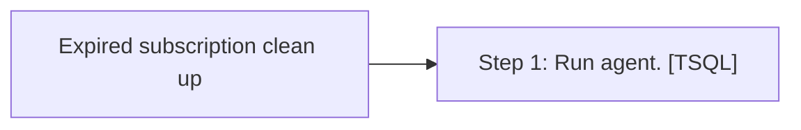

# Job: Expired subscription clean up

**Enabled:** Yes  
**Server:** bedrockdb01  
**Description:** Detects and removes expired subscriptions from published databases.  

## Architecture Diagram



## Steps

### Step 1: Run agent.
**Subsystem:** TSQL  

```sql
EXEC sys.sp_expired_subscription_cleanup
```

