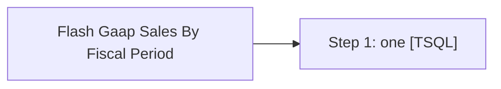

# Job: Flash Gaap Sales By Fiscal Period

**Enabled:** No  
**Server:** bedrockdb01  
**Description:** Captures archived daily GaapSales into CSV, sends email with link to file  

## Architecture Diagram



## Steps

### Step 1: one
**Subsystem:** TSQL  

```sql
exec spAuditworksEmailFlashGaapArchiveForLastFiscalPeriod
```

