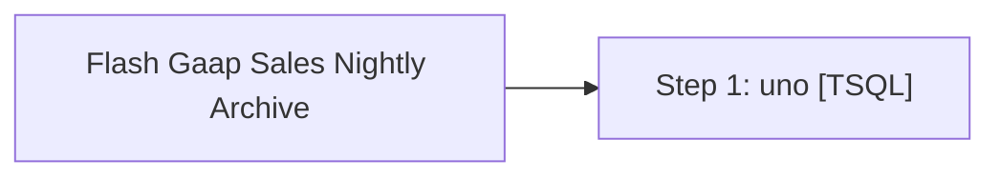

# Job: Flash Gaap Sales Nightly Archive

**Enabled:** No  
**Server:** bedrockdb01  
**Description:** Archives the flash gaap sales per store that was captured from the stores and/or auditworks by another process that runs daily  

## Architecture Diagram



## Steps

### Step 1: uno
**Subsystem:** TSQL  

```sql
exec spAuditworksArchiveFlashGaapSales
```

