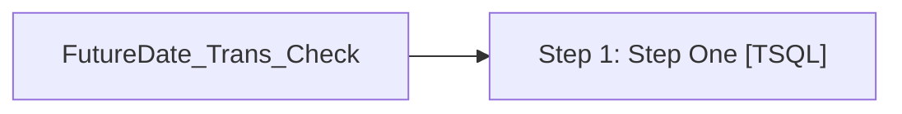

# Job: FutureDate_Trans_Check

**Enabled:** Yes  
**Server:** bedrockdb01  
**Description:** This Checks to see if there are Transactions in SA with a Date ahead of the actual transaction date  

## Architecture Diagram



## Steps

### Step 1: Step One
**Subsystem:** TSQL  

```sql
exec spFutureDateTransCheck
```

