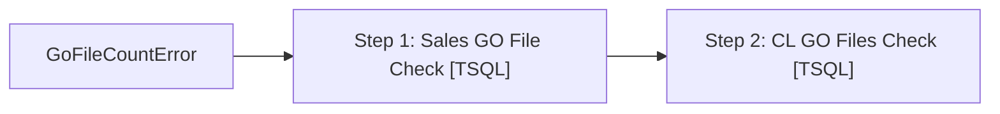

# Job: GoFileCountError

**Enabled:** No  
**Server:** bedrockdb01  
**Description:** No description available.  

## Architecture Diagram



## Steps

### Step 1: Sales GO File Check
**Subsystem:** TSQL  

```sql
exec dbo.usp_GoFileCountError
```

### Step 2: CL GO Files Check
**Subsystem:** TSQL  

```sql
exec dbo.usp_CLGoFileCountError
```

