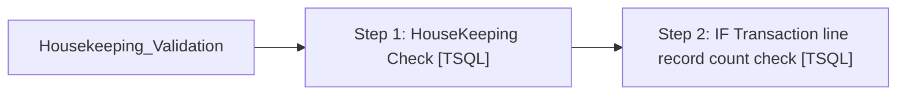

# Job: Housekeeping_Validation

**Enabled:** Yes  
**Server:** bedrockdb01  
**Description:** No description available.  

## Architecture Diagram



## Steps

### Step 1: HouseKeeping Check
**Subsystem:** TSQL  

```sql
exec spHousekeepingValidation
```

### Step 2: IF Transaction line record count check
**Subsystem:** TSQL  

```sql
exec spIFTransactionTableThresholdCheck
```

