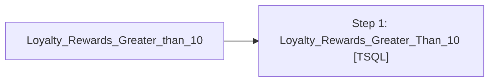

# Job: Loyalty_Rewards_Greater_than_10

**Enabled:** Yes  
**Server:** bedrockdb01  
**Description:** No description available.  

## Architecture Diagram



## Steps

### Step 1: Loyalty_Rewards_Greater_Than_10
**Subsystem:** TSQL  

```sql
exec spLoyaltyRewardsGreaterThan10


/*
IF (Object_ID('tempdb..##Cert_Greater_Than_10') IS NOT NULL) DROP TABLE ##Cert_Greater_Than_10
select reference_no, date_issued, liability_amount
into ##Cert_Greater_Than_10
from cust_liability
where reference_type = 31
and liability_amount > 10
and date_issued > '07-12-2006'
order by reference_no

set nocount on 
declare @recipients varchar(8000)
declare @subject varchar(500)
declare @msg varchar(1000)

set @recipients = 'posadmin@buildabear.com'
set @subject = 'Loyalty Rewards Greater than 10'
set @msg = 'Attached are reward certificates that are greater than 10 in AW' 

if (select count(*) from ##Cert_Greater_Than_10) > 0  
begin
	exec msdb.dbo.sp_send_dbmail  
		@recipients = @recipients,
		@subject=@subject, 
		@query_result_width = 250,
		@body = @msg,
		@query= 'select * from ##Cert_Greater_Than_10'

end
return
GO
*/
```

